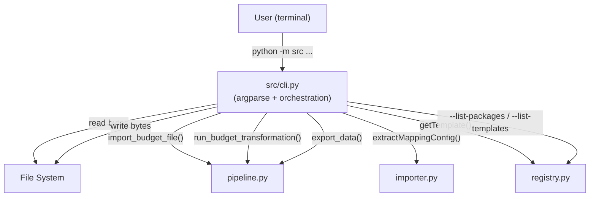

# Design Document: CLI Entry Point

## Overview

This design adds a thin CLI wrapper around the existing budget conversion pipeline. The CLI uses Python's `argparse` to parse command-line arguments, then delegates to the existing modules: `pipeline.import_budget_file()`, `registry.getTemplate()`, `pipeline.run_budget_transformation()`, and `pipeline.export_data()`. No new business logic is introduced — the CLI is purely an orchestration layer.

The CLI is invocable as `python -m src` (via `src/__main__.py`) or `python main.py` (a thin shim at the project root). It follows Unix conventions: exit code 0 for success, 1 for user input errors, 2 for transformation/export errors; errors go to stderr, data output goes to stdout or a file.

## Architecture



The CLI module (`src/cli.py`) is the only new file with meaningful logic. Two additional files (`src/__main__.py` and `main.py`) are trivial entry-point shims.

### Design Decisions

1. **Single module, not a package**: The CLI logic lives in one file (`src/cli.py`) because it's a thin wrapper with no internal complexity worth splitting.
2. **argparse over click/typer**: The project has no CLI dependency yet, and argparse is stdlib. No new dependency needed.
3. **Reuse `parseExcelFile` + `extractMappingConfig` directly**: The `import_budget_file()` function calls `assert_client_side_only()` which may raise in a server/CLI context. Instead, the CLI reads file bytes, calls `parseExcelFile()` and `extractBudgetData()` directly from the importer, then calls `extractMappingConfig()` separately. This avoids the client-side-only assertion while reusing all parsing logic.
4. **Verbosity via a simple log function**: Rather than pulling in `logging`, the CLI uses a closure over the verbosity level that prints to stderr. This keeps the module self-contained.

## Components and Interfaces

### `src/cli.py` — CLI Module

The main module containing argument parsing and orchestration.

#### `build_parser() -> argparse.ArgumentParser`

Constructs and returns the argument parser with all flags and positional arguments.

**Arguments:**

| Argument | Type | Required | Default | Description |
|---|---|---|---|---|
| `input_file` | positional str | Yes | — | Path to the .xlsx budget file |
| `package` | positional str | Yes | — | Accounting package name |
| `template` | positional str | Yes | — | Template name within the package |
| `--budgetcode` | str | Yes | — | Budget code identifier |
| `--year` | int | Yes | — | Budget year |
| `--output`, `-o` | str | No | None | Output file path |
| `--format`, `-f` | str | No | `"csv"` | Export format: `csv` or `excel` |
| `--verbose`, `-v` | flag | No | False | Print progress messages to stderr |
| `--quiet`, `-q` | flag | No | False | Suppress all non-error output |
| `--list-packages` | flag | No | False | List available packages and exit |
| `--list-templates` | str | No | None | List templates for a package and exit |
| `--version` | flag | No | False | Print version and exit |

#### `run(args: argparse.Namespace) -> int`

Orchestrates the full pipeline. Returns an exit code (0, 1, or 2).

**Steps:**
1. Handle `--list-packages` / `--list-templates` early-exit commands
2. Read input file bytes from disk
3. Parse Excel file via `parseExcelFile()`
4. Extract budget data via `extractBudgetData()`
5. Extract mapping config via `extractMappingConfig()`
6. Retrieve template via `getTemplate()`
7. Build `UserParams` from `--budgetcode` and `--year`
8. Run transformation via `run_budget_transformation()`
9. Export result via `export_data()`
10. Write output to file or stdout

#### `main() -> None`

Entry point: calls `build_parser()`, parses `sys.argv`, calls `run()`, and calls `sys.exit()` with the return code.

### `src/__main__.py` — Package Entry Point

```python
from src.cli import main
main()
```

### `main.py` — Root Entry Point

```python
from src.cli import main
main()
```

## Data Models

No new data types are introduced. The CLI reuses all existing types from `src/core/types.py`:

- **`UserParams`** — constructed from `--budgetcode` and `--year` arguments
- **`FileFormat`** — mapped from the `--format` argument string (`"csv"` → `FileFormat.CSV`, `"excel"` → `FileFormat.EXCEL`)
- **`MappingConfig`** — extracted from the input file via `extractMappingConfig()`
- **`OutputTemplate`** — retrieved from the registry via `getTemplate()`
- **`TransformSuccess` / `TransformError`** — result of `run_budget_transformation()`
- **`TabularData`** — intermediate data flowing through the pipeline

The CLI maps string arguments to these types at the boundary and passes them into existing functions unchanged.


## Correctness Properties

*A property is a characteristic or behavior that should hold true across all valid executions of a system — essentially, a formal statement about what the system should do. Properties serve as the bridge between human-readable specifications and machine-verifiable correctness guarantees.*

### Property 1: Argument parsing round-trip

*For any* valid combination of required arguments (input file path, package, template, budgetcode, year) and optional arguments (output path, format), parsing the argument list should produce a namespace where each attribute exactly matches the provided value, and omitted optional arguments should have their documented defaults (format defaults to "csv", output defaults to None).

**Validates: Requirements 1.1, 1.2, 1.3, 1.4**

### Property 2: Non-existent file paths produce exit code 1

*For any* file path string that does not correspond to an existing file on disk, the CLI `run()` function should return exit code 1 and write an error message containing "not found" to stderr.

**Validates: Requirements 2.2, 6.2**

### Property 3: Invalid file bytes produce exit code 1

*For any* byte sequence that is not a valid .xlsx file, the CLI `run()` function should return exit code 1 and write a parse error message to stderr.

**Validates: Requirements 2.3, 6.2**

### Property 4: Invalid registry lookups list available alternatives

*For any* string that is not a valid accounting package name, the CLI should exit with code 1 and the stderr output should contain every available package name. Similarly, *for any* valid package name paired with an invalid template name, the CLI should exit with code 1 and stderr should contain every available template name for that package.

**Validates: Requirements 3.2, 3.3, 6.2**

### Property 5: Transformation errors produce exit code 2 with stderr output

*For any* `TransformError` returned by the pipeline, the CLI should return exit code 2 and the error's message string should appear in stderr output.

**Validates: Requirements 4.2, 6.3, 6.4**

### Property 6: Stdout cleanliness on file output

*For any* successful CLI run where an output file path is specified, stdout should be empty — all exported data should be written to the file, not to stdout.

**Validates: Requirements 6.5**

### Property 7: Quiet mode suppresses non-error stderr

*For any* successful CLI run with the `--quiet` flag, stderr should be empty (no progress messages, no summary line).

**Validates: Requirements 7.2**

### Property 8: Format argument maps to correct FileFormat

*For any* valid format string ("csv" or "excel", case-insensitive), the CLI should pass the corresponding `FileFormat` enum value to the export function, and the resulting output bytes should match that format.

**Validates: Requirements 5.3, 5.4**

## Error Handling

The CLI handles errors at three levels:

### 1. Argument-level errors (handled by argparse)
- Missing required arguments → argparse prints usage and exits with code 2 (argparse default). We override this to exit with code 1 by subclassing `ArgumentParser` and overriding `error()`.
- Invalid `--year` (non-integer) → same handling.
- Mutually exclusive `--verbose` and `--quiet` → argparse mutual exclusion group.

### 2. Input validation errors (exit code 1)
- File not found → `FileNotFoundError` caught, message to stderr.
- File read permission denied → `PermissionError` caught, message to stderr.
- Invalid .xlsx → `parseExcelFile()` returns `ParseError`, message to stderr.
- Missing budget sheet → `extractBudgetData()` returns `ParseError`, message to stderr.
- Missing mapping columns → `extractMappingConfig()` returns `MappingError`, message to stderr.
- Unknown package/template → `TemplateError` caught, message includes available options from the exception's attributes.

### 3. Pipeline/export errors (exit code 2)
- Transformation failure → `run_budget_transformation()` returns `TransformError`, message to stderr.
- Export failure → exception from `export_data()` caught, message to stderr.
- File write failure → `IOError`/`OSError` caught, message to stderr.

All error messages follow the pattern: `Error: {description}` printed to stderr. No stack traces are shown unless `--verbose` is active (in which case the full traceback is appended).

## Testing Strategy

### Unit Tests

Unit tests cover specific examples and integration points:

- `--help` produces usage text mentioning all arguments (Req 1.5)
- `--version` prints the version string (Req 1.6)
- `--list-packages` prints all package names (Req 3.4)
- `--list-templates <package>` prints template names (Req 3.5)
- End-to-end happy path with a fixture .xlsx file: file → transform → CSV output (Req 4.1, 4.3, 5.6, 6.1)
- CSV output to stdout when no output path given (Req 5.2)
- Excel output to default filename when no output path given (Req 5.2)
- Output written to specified file path (Req 5.1)
- Write failure produces exit code 2 (Req 5.5)
- `--verbose` prints stage progress messages (Req 7.1)
- Default mode prints summary line (Req 7.3)

### Property-Based Tests

Property-based tests use the **Hypothesis** library (already present in the project's `.hypothesis/` directory). Each test runs a minimum of 100 iterations.

Each property test references its design document property with a comment tag:
- **Feature: cli-entry-point, Property 1: Argument parsing round-trip**
- **Feature: cli-entry-point, Property 2: Non-existent file paths produce exit code 1**
- **Feature: cli-entry-point, Property 3: Invalid file bytes produce exit code 1**
- **Feature: cli-entry-point, Property 4: Invalid registry lookups list available alternatives**
- **Feature: cli-entry-point, Property 5: Transformation errors produce exit code 2 with stderr output**
- **Feature: cli-entry-point, Property 6: Stdout cleanliness on file output**
- **Feature: cli-entry-point, Property 7: Quiet mode suppresses non-error stderr**
- **Feature: cli-entry-point, Property 8: Format argument maps to correct FileFormat**

### Test File Organization

- `tests/test_cli.py` — unit tests for specific examples and integration
- `tests/test_cli_properties.py` — property-based tests for the 8 correctness properties
