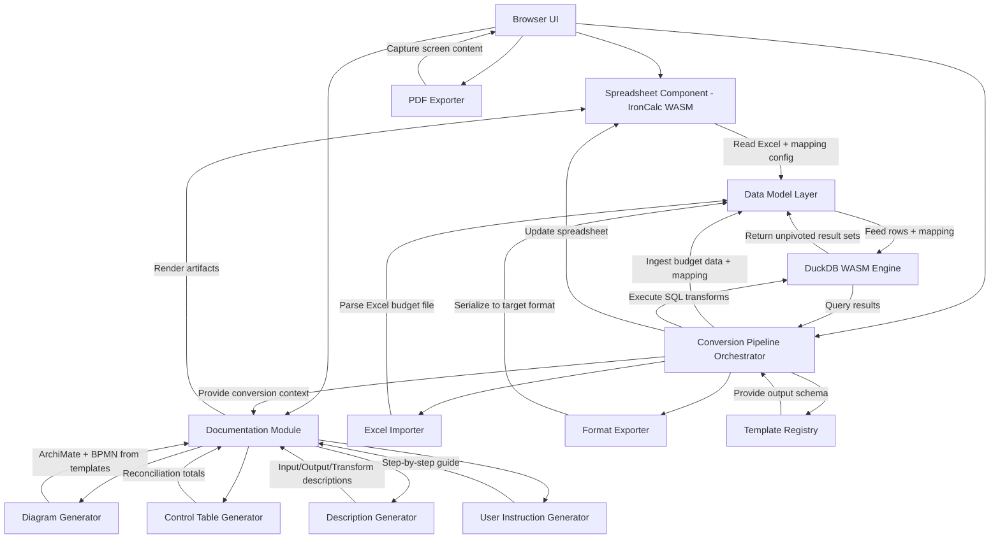
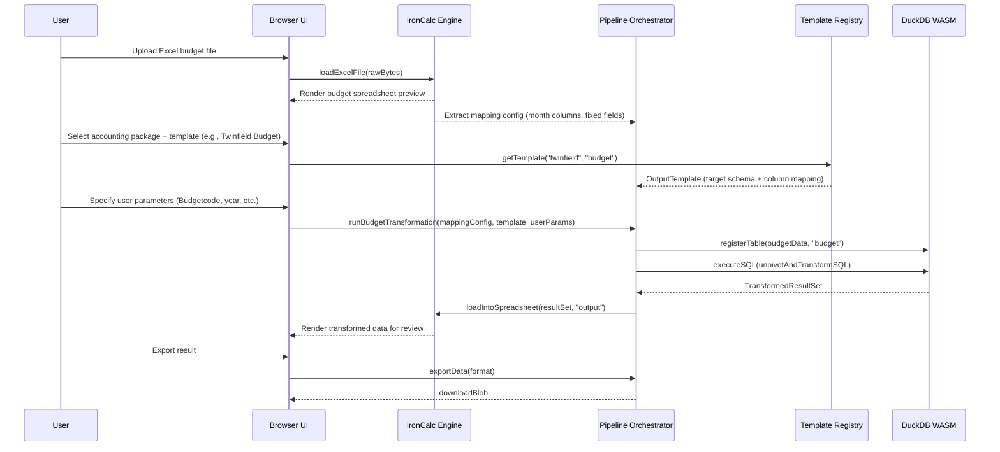

# Design Document: Data Conversion Tool

## Overview

The Data Conversion Tool is a browser-based budget data conversion pipeline that transforms Excel budget files into accounting package import formats. It combines IronCalc (open-source spreadsheet engine) with DuckDB for the transformation logic, running entirely client-side via WebAssembly (WASM).

This tool (excel2budget) is one application module within a larger system. Other modules include update_forecast, reporting_actuals, and potentially others. Each module handles a specific conversion use case but shares a common Documentation Module that generates standardized documentation artifacts (ArchiMate diagrams, BPMN diagrams, input/output/transform descriptions, control tables, and user instructions) via a generic ApplicationContext interface.

The primary use case is converting budget data from wide-format Excel files (with month columns) into the long/unpivoted format required by accounting packages such as Twinfield, Exact, and Afas. Each accounting package has its own predefined output template defining the target column schema.

The Excel file serves a dual purpose: it contains both the budget data and the column mapping configuration. IronCalc ingests the Excel file, reads the mapping definitions, and presents the source data for review. DuckDB handles the heavy transformation — unpivoting month columns into rows, splitting Debet/Credit based on the DC flag, adding fixed fields (like Budgetcode), and reshaping data to match the selected output template. The tool processes one file at a time.

### Reference: Existing M Code Transformation

The tool replicates the logic currently implemented in Power Query M code (see `existing_m_code.md`), which performs:
1. Read from an Excel "Budget" table with month columns (jan-26, feb-26, ... dec-26)
2. Rename month columns to period codes (26P01, 26P02, ...)
3. Filter out rows with null accounts
4. Unpivot month columns into Period + Value rows
5. Extract year (2026) and period number from the period code
6. Rename columns to Dutch accounting terms (e.g., Account → Grootboekrekening)
7. Add fixed fields (Budgetcode = "010")
8. Split Value into Debet/Credit based on DC flag (D = debit, C = credit, absolute values)
9. Add placeholder null columns (Kostenplaats, Project, Hvlhd columns)
10. Reorder columns to match the Twinfield Budget template
11. Apply type conversions and rounding

## Architecture



## Sequence Diagrams

### Budget Import and Transform Flow



## Components and Interfaces

### Component 1: Excel Importer

**Purpose**: Parses Excel budget files, extracting both the budget data and the column mapping configuration embedded in the file.

```pascal
INTERFACE ExcelImporter
  PROCEDURE parseExcelFile(rawBytes: Bytes) -> ExcelWorkbook
  PROCEDURE extractBudgetData(workbook: ExcelWorkbook, sheetName: String) -> TabularData
  PROCEDURE extractMappingConfig(workbook: ExcelWorkbook) -> MappingConfig
  PROCEDURE detectMonthColumns(data: TabularData, config: MappingConfig) -> List<MonthColumnDef>
END INTERFACE
```

**Responsibilities**:
- Parse .xlsx files into workbook structure
- Extract budget data from the specified sheet/named range
- Read column mapping configuration from the Excel file (which columns are months, which are Entity, Account, DC, etc.)
- Detect and validate month column positions

### Component 2: IronCalc Spreadsheet Engine (WASM)

**Purpose**: Provides spreadsheet rendering for both input preview and output review. Reads the Excel file including its mapping configuration.

```pascal
INTERFACE SpreadsheetEngine
  PROCEDURE loadExcelFile(rawBytes: Bytes) -> WorkbookHandle
  PROCEDURE loadData(data: TabularData, sheetName: String) -> SheetHandle
  PROCEDURE getCellValue(sheet: SheetHandle, row: Integer, col: Integer) -> CellValue
  PROCEDURE setCellValue(sheet: SheetHandle, row: Integer, col: Integer, value: CellValue)
  PROCEDURE exportSheetData(sheet: SheetHandle) -> TabularData
  PROCEDURE getSheetNames(workbook: WorkbookHandle) -> List<String>
END INTERFACE
```

**Responsibilities**:
- Render the source Excel budget data in a spreadsheet grid for user review
- Display the transformed output data for verification before export
- Allow light cell editing if needed before transformation
- Extract sheet data back to TabularData for pipeline use

### Component 3: DuckDB WASM Engine

**Purpose**: Executes SQL queries for the budget data transformation — unpivoting month columns, splitting Debet/Credit, and reshaping to the target template schema.

```pascal
INTERFACE DuckDBEngine
  PROCEDURE initialize() -> DBHandle
  PROCEDURE registerTable(db: DBHandle, data: TabularData, tableName: String)
  PROCEDURE executeSQL(db: DBHandle, sql: String) -> ResultSet
  PROCEDURE dropTable(db: DBHandle, tableName: String)
  PROCEDURE listTables(db: DBHandle) -> List<String>
END INTERFACE
```

**Responsibilities**:
- Register budget data as an in-memory table
- Execute the unpivot transformation (wide months → long rows)
- Handle Debet/Credit splitting based on DC flag
- Apply column renaming, type casting, and rounding
- Return typed result sets matching the target template schema

### Component 4: Template Registry

**Purpose**: Manages predefined output templates for each accounting package. Each template defines the target column schema, column ordering, data types, and any fixed/default values.

```pascal
INTERFACE TemplateRegistry
  PROCEDURE getTemplate(packageName: String, templateName: String) -> OutputTemplate
  PROCEDURE listPackages() -> List<String>
  PROCEDURE listTemplates(packageName: String) -> List<String>
  PROCEDURE validateOutput(data: TabularData, template: OutputTemplate) -> ValidationResult
END INTERFACE
```

**Supported Accounting Packages**:
- **Twinfield**: Budget template (Entity, Budgetcode, Grootboekrekening, Kostenplaats, Project, Jaar, Periode, Debet, Credit, Hvlhd1 Debet, Hvlhd1 Credit, Hvlhd2 Debet, Hvlhd2 Credit)
- **Exact**: Budget template (TBD — specific columns per Exact's import spec)
- **Afas**: Budget template (TBD — specific columns per Afas's import spec)

**Responsibilities**:
- Store and retrieve output template definitions
- Validate transformed data against the target template schema
- Provide the SQL generation hints (column names, types, ordering) for the transformation

### Component 5: Conversion Pipeline Orchestrator

**Purpose**: Coordinates the end-to-end budget conversion flow: import Excel → read mapping → select template → transform via DuckDB → display in IronCalc → export.

```pascal
INTERFACE PipelineOrchestrator
  PROCEDURE importBudgetFile(rawBytes: Bytes) -> BudgetImportResult
  PROCEDURE runBudgetTransformation(
    mappingConfig: MappingConfig,
    template: OutputTemplate,
    userParams: UserParams
  ) -> TransformResult
  PROCEDURE exportData(sourceRef: TableRef, format: FileFormat) -> Bytes
  PROCEDURE generateTransformSQL(
    mappingConfig: MappingConfig,
    template: OutputTemplate,
    userParams: UserParams
  ) -> String
END INTERFACE
```

**Responsibilities**:
- Wire together Excel importer, DuckDB, IronCalc, template registry, and exporter
- Generate the DuckDB SQL for the unpivot + reshape transformation based on mapping config and template
- Manage the conversion state (source data, mapping, selected template, user params)
- Handle errors across the pipeline and surface them to the UI

### Component 6: Format Exporter

**Purpose**: Serializes the transformed TabularData into the output file format required by the accounting package.

```pascal
INTERFACE FormatExporter
  PROCEDURE exportToCSV(data: TabularData) -> Bytes
  PROCEDURE exportToExcel(data: TabularData, template: OutputTemplate) -> Bytes
END INTERFACE
```

**Responsibilities**:
- Serialize transformed data to CSV or Excel format for import into the accounting package
- Preserve column types and ordering as defined by the output template
- Generate downloadable blobs

### Component 7: Documentation Module

**Purpose**: A separate, reusable module responsible for generating all 7 documentation artifacts per conversion configuration. It is application-agnostic — it works with any application module (excel2budget, update_forecast, reporting_actuals, etc.) through a generic `ApplicationContext` interface. Each application module populates the ApplicationContext with its own domain-specific metadata; the Documentation Module never depends on application-specific types like MappingConfig.

```pascal
INTERFACE DocumentationModule
  PROCEDURE generateDocumentationPack(
    context: ApplicationContext
  ) -> DocumentationPack
END INTERFACE
```

The module contains 4 sub-components:

**7a. Diagram Generator** — Generates ArchiMate and BPMN diagrams from standard templates.

```pascal
INTERFACE DiagramGenerator
  PROCEDURE generateArchiMateDiagram(
    context: ApplicationContext,
    archimateTemplate: DiagramTemplate
  ) -> DiagramOutput
  PROCEDURE generateBPMNDiagram(
    context: ApplicationContext,
    bpmnTemplate: DiagramTemplate
  ) -> DiagramOutput
END INTERFACE
```

**7b. Control Table Generator** — Generates the reconciliation sheet proving input totals equal output totals.

```pascal
INTERFACE ControlTableGenerator
  PROCEDURE generateControlTable(
    context: ApplicationContext
  ) -> ControlTable
END INTERFACE
```

**7c. Description Generator** — Generates input, output, and transform description documents.

```pascal
INTERFACE DescriptionGenerator
  PROCEDURE generateInputDescription(context: ApplicationContext) -> DocumentArtifact
  PROCEDURE generateOutputDescription(context: ApplicationContext) -> DocumentArtifact
  PROCEDURE generateTransformDescription(context: ApplicationContext) -> DocumentArtifact
END INTERFACE
```

**7d. User Instruction Generator** — Generates step-by-step user guidance specific to the configuration.

```pascal
INTERFACE UserInstructionGenerator
  PROCEDURE generateUserInstruction(context: ApplicationContext) -> DocumentArtifact
END INTERFACE
```

**Responsibilities**:
- Generate all 7 documentation artifacts for any application module via the generic ApplicationContext
- Accept standard ArchiMate and BPMN templates (to be provided) and populate with context-specific values
- Compute reconciliation totals for the control table using generic source/target summaries
- Describe source structure, target structure, and transformation logic in human-readable form
- Produce step-by-step user instructions specific to the application and target system
- Make all artifacts viewable in the UI and available for PDF export
- Operate as a separate module with no dependencies on application-specific types (MappingConfig, UserParams, etc.)

### Component 8: PDF Exporter

**Purpose**: Captures any screen in the tool and exports it as a PDF document, including date stamps and metadata.

```pascal
INTERFACE PDFExporter
  PROCEDURE exportScreenToPDF(screenContent: ScreenCapture, metadata: PDFMetadata) -> Bytes
END INTERFACE
```

**Responsibilities**:
- Capture the full content of any screen (spreadsheet data, diagrams, control table)
- Include date stamp, configuration name, accounting package, and template in the PDF
- Preserve layout and formatting
- Generate downloadable PDF blob

## Data Models

### TabularData

```pascal
STRUCTURE TabularData
  columns: List<ColumnDef>
  rows: List<Row>
  rowCount: Integer
  metadata: DataMetadata
END STRUCTURE

STRUCTURE ColumnDef
  name: String
  dataType: DataType
  nullable: Boolean
END STRUCTURE

ENUMERATION DataType
  STRING, INTEGER, FLOAT, BOOLEAN, DATE, DATETIME, NULL
END ENUMERATION

STRUCTURE Row
  values: List<CellValue>
END STRUCTURE

STRUCTURE CellValue
  VARIANT StringVal(value: String)
  VARIANT IntVal(value: Integer)
  VARIANT FloatVal(value: Float)
  VARIANT BoolVal(value: Boolean)
  VARIANT DateVal(value: String)  // ISO 8601
  VARIANT NullVal
END STRUCTURE

STRUCTURE DataMetadata
  sourceName: String
  sourceFormat: FileFormat
  importedAt: DateTime                // Date stamp when data was imported
  transformedAt: DateTime             // Date stamp when transformation was executed (null for source data)
  exportedAt: DateTime                // Date stamp when data was exported (null until export)
  encoding: String
END STRUCTURE
```

**Validation Rules**:
- Every Row must have exactly `columns.length` values
- Column names must be unique within a TabularData instance
- rowCount must equal rows.length

### MappingConfig

Extracted from the Excel file. Defines how source columns map to the transformation.

```pascal
STRUCTURE MappingConfig
  entityColumn: String              // Column name for Entity
  accountColumn: String             // Column name for Account (→ Grootboekrekening)
  dcColumn: String                  // Column name for Debet/Credit flag ("D" or "C")
  monthColumns: List<MonthColumnDef> // Which columns represent months
END STRUCTURE

STRUCTURE MonthColumnDef
  sourceColumnName: String          // e.g., "jan-26", "feb-26"
  periodNumber: Integer             // 1..12
  year: Integer                     // e.g., 2026
END STRUCTURE
```

**Validation Rules**:
- entityColumn, accountColumn, dcColumn must exist in the source data
- monthColumns must have between 1 and 12 entries
- periodNumber must be unique within monthColumns and in range 1..12

### UserParams

User-specified parameters per conversion run.

```pascal
STRUCTURE UserParams
  budgetcode: String                // e.g., "010"
  year: Integer                     // e.g., 2026 (can override detected year)
END STRUCTURE
```

### OutputTemplate

Defines the target schema for a specific accounting package import format.

```pascal
STRUCTURE OutputTemplate
  packageName: String               // e.g., "twinfield", "exact", "afas"
  templateName: String              // e.g., "budget"
  columns: List<TemplateColumnDef>  // Ordered list of output columns
END STRUCTURE

STRUCTURE TemplateColumnDef
  name: String                      // Output column name (e.g., "Grootboekrekening")
  dataType: DataType                // Expected data type
  nullable: Boolean                 // Whether null values are allowed
  sourceMapping: ColumnSourceMapping // Where the value comes from
END STRUCTURE

ENUMERATION ColumnSourceMapping
  VARIANT FromSource(sourceColumnName: String)   // Maps from a source column
  VARIANT FromUserParam(paramName: String)       // Maps from user-specified parameter
  VARIANT FromTransform(expression: String)      // Computed during transformation (e.g., period extraction)
  VARIANT FixedNull                              // Always null placeholder
END ENUMERATION
```

**Example: Twinfield Budget Template**:
```
columns:
  - name: "Entity",              sourceMapping: FromSource("Entity")
  - name: "Budgetcode",          sourceMapping: FromUserParam("budgetcode")
  - name: "Grootboekrekening",   sourceMapping: FromSource("Account")
  - name: "Kostenplaats",        sourceMapping: FixedNull
  - name: "Project",             sourceMapping: FixedNull
  - name: "Jaar",                sourceMapping: FromUserParam("year")
  - name: "Periode",             sourceMapping: FromTransform("period_number")
  - name: "Debet",               sourceMapping: FromTransform("CASE WHEN DC='D' THEN ROUND(Value,2) ELSE NULL END")
  - name: "Credit",              sourceMapping: FromTransform("CASE WHEN DC='C' THEN ROUND(ABS(Value),2) ELSE NULL END")
  - name: "Hvlhd1 Debet",       sourceMapping: FixedNull
  - name: "Hvlhd1 Credit",      sourceMapping: FixedNull
  - name: "Hvlhd2 Debet",       sourceMapping: FixedNull
  - name: "Hvlhd2 Credit",      sourceMapping: FixedNull
```

### TableRef

```pascal
STRUCTURE TableRef
  tableName: String
  schema: List<ColumnDef>
  rowCount: Integer
  registeredInDuckDB: Boolean
  registeredInIronCalc: Boolean
END STRUCTURE
```

### TransformResult

```pascal
STRUCTURE TransformResult
  VARIANT Success(data: TabularData, executionTimeMs: Integer)
  VARIANT Error(message: String, sqlState: String)
END STRUCTURE
```

### FileFormat

```pascal
ENUMERATION FileFormat
  CSV, EXCEL
END ENUMERATION
```

### ControlTable

```pascal
STRUCTURE ControlTable
  totals: ControlTotals               // Generic control totals from ApplicationContext
  generatedAt: DateTime               // Timestamp of control table generation
END STRUCTURE
```

**Validation Rules**:
- All balanceChecks in totals must have passed = true for a valid transformation
- outputRowCount must be consistent with the transformation logic (e.g., inputRowCount × monthColumnCount for excel2budget)

### ConversionConfiguration

Budget-specific configuration that the excel2budget application module uses internally.

```pascal
STRUCTURE ConversionConfiguration
  packageName: String                 // e.g., "twinfield"
  templateName: String                // e.g., "budget"
  mappingConfig: MappingConfig
  userParams: UserParams
  sourceFileName: String
  configurationDate: DateTime         // When this configuration was created/used
END STRUCTURE
```

### ApplicationContext

Generic context structure used by the Documentation Module. Each application module (excel2budget, update_forecast, reporting_actuals, etc.) populates this with its own domain-specific metadata. The Documentation Module depends only on this structure — never on application-specific types.

```pascal
STRUCTURE ApplicationContext
  // Identity
  applicationName: String             // e.g., "excel2budget", "update_forecast", "reporting_actuals"
  configurationName: String           // e.g., "Twinfield Budget 2026"
  configurationDate: DateTime
  
  // Systems involved (for ArchiMate)
  sourceSystem: SystemDescriptor      // e.g., "Excel Budget File"
  targetSystem: SystemDescriptor      // e.g., "Twinfield"
  intermediarySystems: List<SystemDescriptor>  // e.g., ["DuckDB WASM", "IronCalc WASM"]
  
  // Process steps (for BPMN)
  processSteps: List<ProcessStep>     // Ordered list of steps in the conversion process
  
  // Source description (for Input Description)
  sourceDescription: DataDescription
  
  // Target description (for Output Description)
  targetDescription: DataDescription
  
  // Transform description
  transformDescription: TransformDescriptor
  
  // Control totals (for Control Table)
  controlTotals: ControlTotals
  
  // User instruction hints
  userInstructionSteps: List<String>  // Step-by-step text for the user guide
END STRUCTURE

STRUCTURE SystemDescriptor
  name: String                        // e.g., "Twinfield", "Excel"
  systemType: String                  // e.g., "Accounting Package", "Spreadsheet", "Conversion Tool"
  description: String                 // Brief description of the system's role
END STRUCTURE

STRUCTURE ProcessStep
  stepNumber: Integer
  name: String                        // e.g., "Upload File", "Run Transformation"
  description: String
  actor: String                       // e.g., "User", "System"
END STRUCTURE

STRUCTURE DataDescription
  name: String                        // e.g., "Budget Excel File", "Twinfield Budget Import"
  columns: List<ColumnDescription>
  additionalNotes: String             // Free-text notes about the data
END STRUCTURE

STRUCTURE ColumnDescription
  name: String
  dataType: String
  description: String                 // What this column represents
  source: String                      // Where the value comes from (e.g., "Source column: Account", "Fixed: 010")
END STRUCTURE

STRUCTURE TransformDescriptor
  name: String                        // e.g., "Budget Unpivot + DC Split"
  description: String                 // Human-readable summary
  steps: List<String>                 // Ordered transformation steps
  generatedQuery: String              // The SQL or equivalent query (optional, for auditability)
END STRUCTURE

STRUCTURE ControlTotals
  inputRowCount: Integer
  outputRowCount: Integer
  inputTotals: List<NamedTotal>       // e.g., [("Budget Values", 125000.00)]
  outputTotals: List<NamedTotal>      // e.g., [("Debet", 80000.00), ("Credit", 45000.00)]
  balanceChecks: List<BalanceCheck>   // e.g., [("Input = Debet + Credit", true)]
END STRUCTURE

STRUCTURE NamedTotal
  label: String
  value: Float
END STRUCTURE

STRUCTURE BalanceCheck
  description: String                 // e.g., "Sum of input values = Sum of Debet + Sum of Credit"
  passed: Boolean
END STRUCTURE
```

**How each application module populates ApplicationContext:**

The excel2budget module builds an ApplicationContext from its ConversionConfiguration, MappingConfig, UserParams, and transformation results. Other modules (update_forecast, reporting_actuals) would do the same from their own domain types. Example for excel2budget:

```pascal
ALGORITHM buildApplicationContext(config, sourceData, transformedData, mappingConfig, template, sql)
INPUT: config of type ConversionConfiguration, sourceData/transformedData of type TabularData, ...
OUTPUT: context of type ApplicationContext

BEGIN
  context.applicationName ← "excel2budget"
  context.configurationName ← config.packageName + " " + config.templateName + " " + TEXT(config.userParams.year)
  context.configurationDate ← config.configurationDate
  
  context.sourceSystem ← SystemDescriptor { name: "Excel", systemType: "Spreadsheet", description: "Budget file: " + config.sourceFileName }
  context.targetSystem ← SystemDescriptor { name: config.packageName, systemType: "Accounting Package", description: config.templateName + " import" }
  context.intermediarySystems ← [
    SystemDescriptor { name: "IronCalc WASM", systemType: "Conversion Tool", description: "Spreadsheet preview" },
    SystemDescriptor { name: "DuckDB WASM", systemType: "Conversion Tool", description: "SQL transformation engine" }
  ]
  
  context.processSteps ← [
    ProcessStep { 1, "Upload Excel File", "User uploads budget .xlsx file", "User" },
    ProcessStep { 2, "Extract Mapping", "System reads column mapping from Excel", "System" },
    ProcessStep { 3, "Set Parameters", "User specifies budgetcode and year", "User" },
    ProcessStep { 4, "Run Transformation", "DuckDB executes unpivot + DC split", "System" },
    ProcessStep { 5, "Review Output", "User reviews transformed data in IronCalc", "User" },
    ProcessStep { 6, "Export", "User downloads result as CSV/Excel", "User" }
  ]
  
  context.sourceDescription ← buildDataDescription(sourceData, mappingConfig)
  context.targetDescription ← buildDataDescription(transformedData, template)
  context.transformDescription ← TransformDescriptor { ..., generatedQuery: sql }
  context.controlTotals ← computeControlTotals(sourceData, transformedData, mappingConfig)
  context.userInstructionSteps ← buildUserSteps(config)
  
  RETURN context
END
```

### DiagramTemplate

```pascal
STRUCTURE DiagramTemplate
  templateType: DiagramType           // ARCHIMATE or BPMN
  templateContent: String             // Base template content (XML/JSON)
  placeholders: List<String>          // Placeholder keys to be replaced with config values
END STRUCTURE

ENUMERATION DiagramType
  ARCHIMATE, BPMN
END ENUMERATION
```

### DiagramOutput

```pascal
STRUCTURE DiagramOutput
  diagramType: DiagramType
  renderedContent: String             // SVG or rendered diagram content
  configurationRef: String            // Which configuration this diagram belongs to
  generatedAt: DateTime
END STRUCTURE
```

### PDFMetadata

```pascal
STRUCTURE PDFMetadata
  screenTitle: String                 // e.g., "Budget Input Preview", "Control Table"
  configurationName: String           // e.g., "Twinfield Budget 2026"
  packageName: String
  templateName: String
  generatedAt: DateTime               // Date stamp for the PDF
END STRUCTURE
```

### DocumentationPack

The complete set of 7 documentation artifacts generated by the Documentation Module for a single application context.

```pascal
STRUCTURE DocumentationPack
  archimate: DiagramOutput            // ArchiMate application-layer diagram
  bpmn: DiagramOutput                 // BPMN process flow diagram
  inputDescription: DocumentArtifact  // Source data structure description
  outputDescription: DocumentArtifact // Target output structure description
  transformDescription: DocumentArtifact // Transformation logic description
  controlTable: ControlTable          // Reconciliation sheet
  userInstruction: DocumentArtifact   // Step-by-step user guide
  applicationContext: ApplicationContext // The generic context this pack was generated from
  generatedAt: DateTime
END STRUCTURE
```

### DocumentArtifact

```pascal
STRUCTURE DocumentArtifact
  title: String                       // e.g., "Input Description", "User Instruction"
  contentType: ArtifactContentType
  content: String                     // Rendered content (HTML/Markdown)
  generatedAt: DateTime
END STRUCTURE

ENUMERATION ArtifactContentType
  INPUT_DESCRIPTION, OUTPUT_DESCRIPTION, TRANSFORM_DESCRIPTION, USER_INSTRUCTION
END ENUMERATION
```

### ScreenCapture

```pascal
STRUCTURE ScreenCapture
  contentType: ScreenContentType
  htmlContent: String                 // Rendered HTML/SVG content to capture
  dimensions: Dimensions
END STRUCTURE

ENUMERATION ScreenContentType
  SPREADSHEET, DIAGRAM, CONTROL_TABLE
END ENUMERATION
```


## Key Functions with Formal Specifications

### Function 1: extractMappingConfig()

```pascal
PROCEDURE extractMappingConfig(workbook: ExcelWorkbook) -> MappingConfig
```

**Preconditions:**
- `workbook` is a valid parsed Excel workbook
- The workbook contains a mapping/config sheet or the mapping is embedded in the budget sheet structure

**Postconditions:**
- Returns a valid MappingConfig with entityColumn, accountColumn, dcColumn identified
- monthColumns contains 1..12 entries with valid period numbers
- All referenced column names exist in the budget data sheet

**Loop Invariants:**
- For month column detection loop: all previously detected month columns have unique period numbers

### Function 2: generateTransformSQL()

```pascal
PROCEDURE generateTransformSQL(
  mappingConfig: MappingConfig,
  template: OutputTemplate,
  userParams: UserParams
) -> String
```

**Preconditions:**
- `mappingConfig` is valid (all referenced columns exist)
- `template` is a valid OutputTemplate with at least one column
- `userParams` contains all parameters referenced by the template

**Postconditions:**
- Returns a syntactically valid DuckDB SQL string
- The SQL performs: UNPIVOT of month columns → Debet/Credit split based on DC flag → column renaming → fixed value injection → column reordering per template
- The SQL references only the "budget" table (registered source)
- The SQL is SELECT-only (no DDL/DML side effects)

**Loop Invariants:** N/A

### Function 3: registerTable()

```pascal
PROCEDURE registerTable(db: DBHandle, data: TabularData, tableName: String)
```

**Preconditions:**
- `db` is an initialized DuckDB handle
- `data` is a valid TabularData (rows match column count)
- `tableName` is a non-empty string matching pattern `[a-zA-Z_][a-zA-Z0-9_]*`

**Postconditions:**
- A table named `tableName` exists in DuckDB with matching schema
- Table contains exactly `data.rowCount` rows
- Column types in DuckDB map correctly from TabularData DataTypes

**Loop Invariants:**
- For row insertion loop: number of inserted rows equals loop iteration count

### Function 4: runBudgetTransformation()

```pascal
PROCEDURE runBudgetTransformation(
  mappingConfig: MappingConfig,
  template: OutputTemplate,
  userParams: UserParams
) -> TransformResult
```

**Preconditions:**
- Budget data is registered in DuckDB as "budget" table
- `mappingConfig` is valid and references columns present in the budget table
- `template` is a valid OutputTemplate
- `userParams` contains required parameters (budgetcode, year)

**Postconditions:**
- On success: returns TransformResult.Success with TabularData matching the template schema
- Output has exactly `template.columns.length` columns in the correct order
- Each source row with N month columns produces N output rows (unpivot)
- Rows with null Account values are filtered out
- Debet column contains ROUND(Value, 2) when DC="D", null otherwise
- Credit column contains ROUND(ABS(Value), 2) when DC="C", null otherwise
- On error: returns TransformResult.Error with message and SQL state code
- Source "budget" table is not modified

**Loop Invariants:** N/A

### Function 5: exportData()

```pascal
PROCEDURE exportData(sourceRef: TableRef, format: FileFormat) -> Bytes
```

**Preconditions:**
- `sourceRef` refers to a table currently registered in the pipeline
- `format` is CSV or EXCEL

**Postconditions:**
- Returns non-empty Bytes representing the serialized data
- Output bytes are valid for the specified format
- Row count in output matches sourceRef.rowCount
- Column ordering matches the output template

**Loop Invariants:**
- For row serialization loop: all previously serialized rows are format-compliant

### Function 6: generateControlTable()

```pascal
PROCEDURE generateControlTable(
  sourceData: TabularData,
  transformedData: TabularData,
  mappingConfig: MappingConfig
) -> ControlTable
```

**Preconditions:**
- `sourceData` is valid TabularData with the month columns referenced in mappingConfig
- `transformedData` is valid TabularData with Debet and Credit columns
- `mappingConfig` is valid

**Postconditions:**
- Returns a ControlTable with correct input/output row counts
- inputValueTotal equals the sum of absolute values across all month columns for all non-null-account rows
- outputDebetTotal equals the sum of all non-null Debet values
- outputCreditTotal equals the sum of all non-null Credit values
- balanceCheck is true if and only if inputValueTotal equals outputDebetTotal + outputCreditTotal (within floating-point tolerance)
- generatedAt is set to the current date-time

**Loop Invariants:** N/A

### Function 7: generateArchiMateDiagram()

```pascal
PROCEDURE generateArchiMateDiagram(
  config: ConversionConfiguration,
  archimateTemplate: DiagramTemplate
) -> DiagramOutput
```

**Preconditions:**
- `config` is a valid ConversionConfiguration with packageName and templateName set
- `archimateTemplate` is a valid DiagramTemplate of type ARCHIMATE
- All placeholders in the template have corresponding values in the config

**Postconditions:**
- Returns a DiagramOutput with renderedContent showing the application-layer systems
- The diagram includes at minimum: source system (Excel), conversion tool, and target accounting package
- generatedAt is set to the current date-time

### Function 8: generateBPMNDiagram()

```pascal
PROCEDURE generateBPMNDiagram(
  config: ConversionConfiguration,
  bpmnTemplate: DiagramTemplate
) -> DiagramOutput
```

**Preconditions:**
- `config` is a valid ConversionConfiguration
- `bpmnTemplate` is a valid DiagramTemplate of type BPMN

**Postconditions:**
- Returns a DiagramOutput with renderedContent showing the process flow
- The diagram includes steps: file upload, mapping extraction, parameter specification, transformation, review, export
- generatedAt is set to the current date-time

### Function 9: exportScreenToPDF()

```pascal
PROCEDURE exportScreenToPDF(screenContent: ScreenCapture, metadata: PDFMetadata) -> Bytes
```

**Preconditions:**
- `screenContent` contains valid rendered content (HTML/SVG)
- `metadata` contains non-empty screenTitle and generatedAt date

**Postconditions:**
- Returns non-empty Bytes representing a valid PDF document
- The PDF includes the screen content, date stamp, and metadata
- Layout and formatting are preserved from the screen rendering

## Algorithmic Pseudocode

### Main Budget Conversion Pipeline

```pascal
ALGORITHM budgetConversion(rawBytes, packageName, templateName, userParams)
INPUT: rawBytes of type Bytes (Excel file), packageName of type String, templateName of type String, userParams of type UserParams
OUTPUT: exportedBytes of type Bytes

BEGIN
  // Step 1: Parse the Excel file
  workbook ← parseExcelFile(rawBytes)
  budgetData ← extractBudgetData(workbook, "Budget")
  
  ASSERT budgetData.rowCount > 0
  ASSERT LENGTH(budgetData.columns) > 0
  
  // Step 2: Extract mapping configuration from the Excel file
  mappingConfig ← extractMappingConfig(workbook)
  
  ASSERT LENGTH(mappingConfig.monthColumns) >= 1
  ASSERT LENGTH(mappingConfig.monthColumns) <= 12
  
  // Step 3: Load into IronCalc for user preview
  sheet ← loadData(budgetData, "budget_input")
  // User reviews source data in IronCalc
  
  // Step 4: Get the output template for the selected accounting package
  template ← getTemplate(packageName, templateName)
  
  // Step 5: Register budget data in DuckDB
  db ← initialize()
  registerTable(db, budgetData, "budget")
  
  // Step 6: Generate and execute the transformation SQL
  sql ← generateTransformSQL(mappingConfig, template, userParams)
  result ← executeSQL(db, sql)
  
  IF result IS Error THEN
    RAISE TransformationError(result.message)
  END IF
  
  transformedData ← resultSetToTabularData(result)
  
  // Step 7: Load transformed data into IronCalc for review
  loadData(transformedData, "budget_output")
  // User reviews output before export
  
  // Step 8: Build generic ApplicationContext and generate documentation pack via Documentation Module
  config ← ConversionConfiguration {
    packageName: packageName,
    templateName: templateName,
    mappingConfig: mappingConfig,
    userParams: userParams,
    sourceFileName: extractFileName(rawBytes),
    configurationDate: NOW()
  }
  
  appContext ← buildApplicationContext(config, budgetData, transformedData, mappingConfig, template, sql)
  docPack ← generateDocumentationPack(appContext)
  // docPack contains all 7 artifacts:
  //   1. ArchiMate diagram (from standard template)
  //   2. BPMN diagram (from standard template)
  //   3. Input description
  //   4. Output description
  //   5. Transform description
  //   6. Control table (with balance check)
  //   7. User instruction
  
  ASSERT docPack.controlTable.balanceCheck = TRUE
  
  // Render all documentation artifacts in IronCalc / UI for review
  loadData(controlTableToTabularData(docPack.controlTable), "control_table")
  
  // Step 9: Export to target format (with date stamp in metadata)
  transformedData.metadata.exportedAt ← NOW()
  exportedBytes ← exportToCSV(transformedData)
  
  RETURN exportedBytes
END
```

**Preconditions:**
- rawBytes is a valid Excel file containing a "Budget" sheet
- packageName and templateName identify a valid output template
- userParams contains required fields (budgetcode, year)

**Postconditions:**
- exportedBytes contains the transformed budget data in the target format
- Output conforms to the selected accounting package template schema
- Source data is not mutated

### SQL Generation for Budget Unpivot

```pascal
ALGORITHM generateTransformSQL(mappingConfig, template, userParams)
INPUT: mappingConfig of type MappingConfig, template of type OutputTemplate, userParams of type UserParams
OUTPUT: sql of type String

BEGIN
  // Build the UNPIVOT clause for month columns
  monthColumnList ← ""
  FOR i ← 0 TO LENGTH(mappingConfig.monthColumns) - 1 DO
    mc ← mappingConfig.monthColumns[i]
    monthColumnList ← monthColumnList + quoteIdentifier(mc.sourceColumnName)
    IF i < LENGTH(mappingConfig.monthColumns) - 1 THEN
      monthColumnList ← monthColumnList + ", "
    END IF
    // Invariant: all month column names so far are valid quoted identifiers
  END FOR
  
  // Build the main transformation query
  // Step 1: UNPIVOT month columns into (Period, Value) rows
  // Step 2: Filter out null accounts
  // Step 3: Extract period number from the unpivoted column name
  // Step 4: Split Value into Debet/Credit based on DC flag
  // Step 5: Add fixed columns (Budgetcode, Kostenplaats, Project, Hvlhd*)
  // Step 6: Reorder columns per template
  
  sql ← "
    WITH unpivoted AS (
      SELECT
        " + quoteIdentifier(mappingConfig.entityColumn) + " AS Entity,
        " + quoteIdentifier(mappingConfig.accountColumn) + " AS Account,
        " + quoteIdentifier(mappingConfig.dcColumn) + " AS DC,
        Period_Col,
        Value
      FROM budget
      UNPIVOT (Value FOR Period_Col IN (" + monthColumnList + "))
      WHERE " + quoteIdentifier(mappingConfig.accountColumn) + " IS NOT NULL
    ),
    with_periods AS (
      SELECT
        Entity,
        Account,
        DC,
        Value,
        " + TEXT(userParams.year) + " AS Jaar,
        -- Extract period number from month column mapping
        CASE Period_Col
  "
  
  // Add CASE branches for each month column → period number
  FOR EACH mc IN mappingConfig.monthColumns DO
    sql ← sql + "      WHEN '" + mc.sourceColumnName + "' THEN " + TEXT(mc.periodNumber) + "
  "
  END FOR
  
  sql ← sql + "
        END AS Periode
      FROM unpivoted
    )
    SELECT
      Entity,
      '" + userParams.budgetcode + "' AS Budgetcode,
      CAST(Account AS VARCHAR) AS Grootboekrekening,
      NULL AS Kostenplaats,
      NULL AS Project,
      Jaar,
      Periode,
      CASE WHEN DC = 'D' THEN ROUND(CAST(Value AS DOUBLE), 4) ELSE NULL END AS Debet,
      CASE WHEN DC = 'C' THEN ROUND(ABS(CAST(Value AS DOUBLE)), 4) ELSE NULL END AS Credit,
      NULL AS \"Hvlhd1 Debet\",
      NULL AS \"Hvlhd1 Credit\",
      NULL AS \"Hvlhd2 Debet\",
      NULL AS \"Hvlhd2 Credit\"
    FROM with_periods
    ORDER BY Entity, Grootboekrekening, Periode
  "
  
  RETURN sql
END
```

**Preconditions:**
- mappingConfig has valid month columns referencing existing source columns
- template defines the target column ordering
- userParams.budgetcode and userParams.year are set

**Postconditions:**
- Returns a valid DuckDB SQL string that performs the full budget transformation
- SQL is SELECT-only (no side effects)
- Output columns match the template schema in name and order

**Loop Invariants:**
- Month column list loop: all generated identifiers are properly quoted
- CASE branch loop: all period mappings are unique

### DuckDB DataType Mapping

```pascal
ALGORITHM mapDataTypeToDuckDB(dataType)
INPUT: dataType of type DataType
OUTPUT: sqlType of type String

BEGIN
  MATCH dataType WITH
    STRING    → RETURN "VARCHAR"
    INTEGER   → RETURN "BIGINT"
    FLOAT     → RETURN "DOUBLE"
    BOOLEAN   → RETURN "BOOLEAN"
    DATE      → RETURN "DATE"
    DATETIME  → RETURN "TIMESTAMP"
    NULL      → RETURN "VARCHAR"
  END MATCH
END
```

### Control Table Generation

The control table generation uses the generic `ControlTotals` from the `ApplicationContext`. Each application module computes its own totals. Below is the excel2budget-specific computation:

```pascal
ALGORITHM computeControlTotals(sourceData, transformedData, mappingConfig)
INPUT: sourceData of type TabularData, transformedData of type TabularData, mappingConfig of type MappingConfig
OUTPUT: controlTotals of type ControlTotals

BEGIN
  // Step 1: Count input rows (after null-account filtering)
  inputRowCount ← 0
  inputValueTotal ← 0.0
  
  FOR EACH row IN sourceData.rows DO
    accountValue ← row.values[indexOf(mappingConfig.accountColumn)]
    IF accountValue IS NOT NullVal THEN
      inputRowCount ← inputRowCount + 1
      
      // Sum all month column values for this row
      FOR EACH mc IN mappingConfig.monthColumns DO
        monthValue ← row.values[indexOf(mc.sourceColumnName)]
        IF monthValue IS NOT NullVal THEN
          inputValueTotal ← inputValueTotal + ABS(toFloat(monthValue))
        END IF
      END FOR
    END IF
    // Invariant: inputRowCount = count of non-null-account rows seen so far
  END FOR
  
  // Step 2: Compute output totals
  outputRowCount ← transformedData.rowCount
  outputDebetTotal ← 0.0
  outputCreditTotal ← 0.0
  
  debetColIdx ← indexOf(transformedData.columns, "Debet")
  creditColIdx ← indexOf(transformedData.columns, "Credit")
  
  FOR EACH row IN transformedData.rows DO
    debetVal ← row.values[debetColIdx]
    creditVal ← row.values[creditColIdx]
    
    IF debetVal IS NOT NullVal THEN
      outputDebetTotal ← outputDebetTotal + toFloat(debetVal)
    END IF
    IF creditVal IS NOT NullVal THEN
      outputCreditTotal ← outputCreditTotal + toFloat(creditVal)
    END IF
    // Invariant: running totals reflect all rows processed so far
  END FOR
  
  // Step 3: Build generic ControlTotals
  RETURN ControlTotals {
    inputRowCount: inputRowCount,
    outputRowCount: outputRowCount,
    inputTotals: [ NamedTotal { label: "Budget Values", value: inputValueTotal } ],
    outputTotals: [
      NamedTotal { label: "Debet", value: outputDebetTotal },
      NamedTotal { label: "Credit", value: outputCreditTotal }
    ],
    balanceChecks: [
      BalanceCheck {
        description: "Sum of input values = Sum of Debet + Sum of Credit",
        passed: ABS(inputValueTotal - (outputDebetTotal + outputCreditTotal)) < 0.01
      }
    ]
  }
END
```

**Preconditions:**
- sourceData and transformedData are valid TabularData
- mappingConfig references valid columns in sourceData

**Postconditions:**
- controlTable.balanceCheck is true if input and output totals reconcile
- controlTable.outputRowCount = controlTable.inputRowCount × controlTable.monthColumnCount

**Loop Invariants:**
- Input row loop: inputRowCount equals count of non-null-account rows processed
- Output row loop: running Debet/Credit totals reflect all rows processed

## Example Usage

### Example 1: Twinfield Budget Conversion (replicating the M code)

```pascal
SEQUENCE
  // User uploads an Excel file with a "Budget" sheet
  // The sheet has columns: Entity, Account, DC, jan-26, feb-26, ..., dec-26
  rawExcel ← readFile("budget_2026.xlsx")
  pipeline ← createPipeline()
  
  // Step 1: Import and preview in IronCalc
  importResult ← pipeline.importBudgetFile(rawExcel)
  // IronCalc displays the budget spreadsheet for user review
  // Mapping config is extracted: Entity, Account, DC columns identified
  // Month columns detected: jan-26 → period 1, feb-26 → period 2, ..., dec-26 → period 12
  
  // Step 2: User selects target accounting package and template
  template ← pipeline.getTemplate("twinfield", "budget")
  
  // Step 3: User specifies parameters
  userParams ← UserParams { budgetcode: "010", year: 2026 }
  
  // Step 4: Run the transformation
  result ← pipeline.runBudgetTransformation(
    importResult.mappingConfig,
    template,
    userParams
  )
  
  IF result IS Success THEN
    // IronCalc displays the transformed output:
    // Entity | Budgetcode | Grootboekrekening | Kostenplaats | Project | Jaar | Periode | Debet | Credit | ...
    // "NL01" | "010"      | "4000"            | null         | null    | 2026 | 1       | 1500.00 | null | ...
    // "NL01" | "010"      | "4000"            | null         | null    | 2026 | 2       | null    | 800.00 | ...
    
    DISPLAY "Transformed " + result.data.rowCount + " rows"
    exportedBytes ← pipeline.exportData(result.data, CSV)
    downloadFile(exportedBytes, "twinfield_budget_import.csv")
  ELSE
    DISPLAY "Error: " + result.message
  END IF
END SEQUENCE
```

### Example 2: Same source, different accounting package

```pascal
SEQUENCE
  // Same Excel budget file, but exporting for Exact instead of Twinfield
  rawExcel ← readFile("budget_2026.xlsx")
  pipeline ← createPipeline()
  
  importResult ← pipeline.importBudgetFile(rawExcel)
  
  // Different template, different output schema
  template ← pipeline.getTemplate("exact", "budget")
  userParams ← UserParams { budgetcode: "BUD2026", year: 2026 }
  
  result ← pipeline.runBudgetTransformation(
    importResult.mappingConfig,
    template,
    userParams
  )
  
  IF result IS Success THEN
    exportedBytes ← pipeline.exportData(result.data, EXCEL)
    downloadFile(exportedBytes, "exact_budget_import.xlsx")
  END IF
END SEQUENCE
```

## Correctness Properties

*A property is a characteristic or behavior that should hold true across all valid executions of a system — essentially, a formal statement about what the system should do. Properties serve as the bridge between human-readable specifications and machine-verifiable correctness guarantees.*

### Property 1: Unpivot row count

*For any* budget table with R data rows (after filtering null accounts) and M month columns, the transformation must produce exactly R × M output rows.

**Validates: Requirements 5.1, 5.2**

### Property 2: Debet/Credit split correctness

*For any* output row, when the source DC flag is "D", Debet equals ROUND(Value, 4) and Credit is null; when the source DC flag is "C", Credit equals ROUND(ABS(Value), 4) and Debet is null. Consequently, exactly one of Debet or Credit is non-null for every output row with a non-null source Value.

**Validates: Requirements 5.3, 5.4, 5.5**

### Property 3: Period range validity

*For any* output row, the Periode value is in the range 1 to 12 and corresponds to the periodNumber of the source month column from the MappingConfig.

**Validates: Requirement 5.6**

### Property 4: Fixed field propagation

*For any* output row, the Budgetcode equals the user-specified budgetcode and the Jaar equals the user-specified year.

**Validates: Requirements 4.1, 5.7, 5.8**

### Property 5: Null account filtering

*For any* transformation output, no row has a null Grootboekrekening value.

**Validates: Requirement 5.9**

### Property 6: Column schema conformance

*For any* transformation output, the TabularData has exactly the columns defined in the selected OutputTemplate, in the correct order, with compatible data types.

**Validates: Requirement 5.10**

### Property 7: DuckDB registration round-trip

*For any* valid TabularData, registering it in DuckDB and immediately selecting all rows returns data equivalent to the original (same schema, same values, same row count).

**Validates: Requirements 7.1, 7.2, 7.3**

### Property 8: Source data immutability

*For any* transformation execution, querying the original budget table in DuckDB before and after the transformation returns identical results, and the source spreadsheet data in IronCalc is unmodified.

**Validates: Requirements 10.1, 10.2**

### Property 9: Transformation determinism

*For any* valid combination of input data, MappingConfig, OutputTemplate, and UserParams, running the transformation twice produces identical output.

**Validates: Requirement 11.1**

### Property 10: Export round-trip

*For any* valid TabularData and export format (CSV or Excel), exporting and re-parsing the output preserves the column ordering, row count, and data values.

**Validates: Requirements 9.1, 9.2, 9.3, 9.4**

### Property 11: Generated SQL validity and safety

*For any* valid MappingConfig, OutputTemplate, and UserParams, the generated SQL is syntactically valid DuckDB SQL, is SELECT-only (no DDL/DML), and references only the "budget" table.

**Validates: Requirements 6.1, 6.2, 6.3**

### Property 12: SQL injection prevention

*For any* MappingConfig containing adversarial column names (with SQL metacharacters), the generated SQL properly escapes or rejects the identifiers.

**Validates: Requirement 6.4**

### Property 13: MappingConfig validity invariant

*For any* successfully extracted MappingConfig, the month columns count is between 1 and 12, all periodNumbers are unique and in range 1 to 12, and all referenced column names exist in the source data.

**Validates: Requirements 2.2, 2.5**

### Property 14: TabularData structural invariants

*For any* TabularData instance in the pipeline, every Row has exactly as many values as there are columns, all column names are unique, and rowCount equals the actual number of rows.

**Validates: Requirements 12.1, 12.2, 12.3**

### Property 15: UserParams validation

*For any* UserParams with an empty or whitespace-only budgetcode, or a non-positive year, the Pipeline rejects the input.

**Validates: Requirements 4.2, 4.3**

### Property 16: Invalid DC value detection

*For any* budget data containing DC column values other than "D" or "C", the Pipeline returns a TransformResult.Error listing the invalid values and their row positions.

**Validates: Requirement 14.1**

### Property 17: OutputTemplate completeness

*For any* valid package and template combination in the Template_Registry, the returned OutputTemplate has non-empty columns with defined names, data types, and source mappings.

**Validates: Requirement 3.3**

### Property 18: XSS sanitization

*For any* string containing HTML or script tags, the sanitization function produces output that does not contain executable script content.

**Validates: Requirement 16.1**

### Property 19: Table name validation

*For any* string that does not match the pattern [a-zA-Z_][a-zA-Z0-9_]*, DuckDB table registration rejects the name.

**Validates: Requirement 7.4**

### Property 20: Control table balance

*For any* successful transformation, all balanceChecks in the ControlTotals have passed = true.

**Validates: Requirements 17.6.2, 17.6.3, 17.6.4**

### Property 21: Control table row count consistency

*For any* successful transformation, the ControlTotals outputRowCount is consistent with the application's transformation logic (e.g., inputRowCount × monthColumnCount for excel2budget).

**Validates: Requirements 17.6.5, 5.2**

### Property 22: Date presence on all screens

*For any* screen rendered by the Pipeline, the screen content includes a visible date in a locale-appropriate format.

**Validates: Requirements 18.1, 18.2**

### Property 23: Data date stamping completeness

*For any* TabularData flowing through the pipeline, the metadata contains a non-null importedAt timestamp; for transformed data, transformedAt is also non-null; for exported data, exportedAt is also non-null.

**Validates: Requirements 19.1, 19.2, 19.3**

### Property 24: PDF export availability

*For any* screen rendered by the Pipeline, the PDF export action produces a non-empty valid PDF document containing the screen content and date stamp.

**Validates: Requirements 20.1, 20.2, 20.3, 20.4**

### Property 25: ArchiMate diagram generation

*For any* valid ConversionConfiguration and ArchiMate template, the generated diagram contains application-layer elements for the source system, conversion tool, and target accounting package.

**Validates: Requirements 17.1.1, 17.1.2, 17.1.3**

### Property 26: BPMN diagram generation

*For any* valid ConversionConfiguration and BPMN template, the generated diagram contains process steps for file upload, mapping extraction, parameter specification, transformation, review, and export.

**Validates: Requirements 17.2.1, 17.2.2, 17.2.3**

### Property 27: Documentation pack completeness

*For any* successful conversion, the Documentation Module produces a DocumentationPack containing all 7 non-null artifacts: ArchiMate diagram, BPMN diagram, input description, output description, transform description, control table, and user instruction.

**Validates: Requirement 17 (General Documentation Module Criteria)**

### Property 28: Input description accuracy

*For any* valid conversion configuration, the input description correctly lists all source column names, their types, and the mapping config assignments (entity, account, DC, month columns).

**Validates: Requirements 17.3.2, 17.3.3**

### Property 29: Output description accuracy

*For any* valid conversion configuration, the output description correctly lists all target column names, types, ordering, and fixed values as defined by the OutputTemplate.

**Validates: Requirements 17.4.2, 17.4.3**

### Property 30: Transform description accuracy

*For any* valid conversion configuration, the transform description includes the unpivot operation, DC split logic, column renaming rules, and the generated SQL or equivalent.

**Validates: Requirements 17.5.2, 17.5.3**

### Property 31: User instruction specificity

*For any* valid conversion configuration, the user instruction references the specific accounting package and template, and includes all process steps.

**Validates: Requirements 17.7.2, 17.7.3**

## Error Handling

### Error Scenario 1: Invalid Excel File

**Condition**: Uploaded file is not a valid .xlsx file or does not contain a "Budget" sheet
**Response**: Return ParseError with details about what was expected vs. found
**Recovery**: User uploads a correct Excel file with the expected structure

### Error Scenario 2: Missing Mapping Configuration

**Condition**: The Excel file does not contain recognizable mapping config, or required columns (Entity, Account, DC) cannot be identified
**Response**: Return MappingError listing which required columns are missing
**Recovery**: User updates the Excel file to include mapping definitions or manually specifies column positions

### Error Scenario 3: No Month Columns Detected

**Condition**: The mapping config specifies month columns that don't exist in the budget data
**Response**: Return MappingError listing available columns and expected month column names
**Recovery**: User corrects the mapping config in the Excel file

### Error Scenario 4: Invalid DC Values

**Condition**: The DC column contains values other than "D" or "C"
**Response**: Return TransformResult.Error listing the invalid values and their row positions
**Recovery**: User fixes the source data

### Error Scenario 5: Unknown Accounting Package or Template

**Condition**: User selects a package/template combination that doesn't exist in the registry
**Response**: Return TemplateError listing available packages and templates
**Recovery**: User selects a valid combination

### Error Scenario 6: WASM Memory Limit

**Condition**: Data size exceeds browser WASM memory allocation
**Response**: Raise MemoryError with current usage and estimated requirement
**Recovery**: User reduces data size or splits the budget file

## Testing Strategy

### Unit Testing Approach

- Test Excel parsing with known budget files (valid structure, missing columns, empty sheets)
- Test mapping config extraction with various Excel layouts
- Test month column detection with different naming conventions
- Test DuckDB type mapping for all DataType variants
- Test Debet/Credit splitting logic with edge cases (zero values, negative values, null DC)
- Test output template validation against known Twinfield/Exact/Afas schemas
- Test export round-trips for CSV and Excel formats
- Test control table generation with known input/output pairs and verify balance check
- Test ArchiMate diagram generation from template with various configurations
- Test BPMN diagram generation from template with various configurations
- Test PDF export produces valid PDF bytes for each screen type (spreadsheet, diagram, control table)
- Test date stamping is present in DataMetadata at each pipeline stage
- Test date display is present on all rendered screens

### Property-Based Testing Approach

**Property Test Library**: fast-check (JavaScript/TypeScript)

- Generate random budget TabularData (with Entity, Account, DC, and N month columns) and verify:
  - Unpivot produces exactly sourceRows × monthColumns output rows
  - Every output row has exactly one of Debet/Credit non-null
  - All Periode values are in 1..12
  - Budgetcode and Jaar match user params in every row
  - No output row has null Grootboekrekening
  - Control table balance check passes (input total = Debet total + Credit total)
  - Control table row count = inputRows × monthColumns
- Generate random MappingConfig and verify generateTransformSQL produces valid DuckDB SQL
- Generate random DC values and verify Debet/Credit split correctness
- Generate random configurations and verify ArchiMate/BPMN diagrams contain required elements

### Integration Testing Approach

- End-to-end pipeline test: import Excel budget → transform for Twinfield → export CSV → verify against known expected output (based on M code results)
- Test with the actual M code reference data to ensure output parity
- Test switching between accounting packages (same input, different templates)
- WASM initialization and teardown lifecycle tests

## Performance Considerations

- **Batch insertion**: Register tables in DuckDB using batch inserts (1000 rows per batch) to minimize WASM boundary crossings
- **Lazy loading**: For large files, load only the first N rows into IronCalc for preview; register full dataset in DuckDB
- **Memory management**: Monitor WASM linear memory usage; warn users before operations that would exceed limits
- **Streaming export**: For large result sets, stream export bytes rather than materializing the entire output in memory
- **Web Worker isolation**: Run DuckDB WASM in a Web Worker to avoid blocking the UI thread during heavy queries

## Security Considerations

- **SQL injection prevention**: Parameterize table names and validate against `[a-zA-Z_][a-zA-Z0-9_]*` pattern; reject arbitrary DDL/DML (only SELECT allowed in transformations)
- **Client-side only**: All data processing happens in-browser; no data leaves the client unless the user explicitly exports/downloads
- **File validation**: Validate file sizes before parsing to prevent memory exhaustion attacks via crafted files
- **Content sanitization**: Sanitize cell values before rendering in the spreadsheet UI to prevent XSS through data content

## Dependencies

- **IronCalc WASM**: Open-source spreadsheet engine compiled to WebAssembly — provides Excel file loading, spreadsheet rendering, and data preview for both input and output
- **DuckDB WASM**: In-browser analytical SQL engine — provides SQL query execution including UNPIVOT, CASE expressions, rounding, and type casting for the budget transformation
- **Excel parsing library**: XLSX reader for extracting budget data and mapping configuration from Excel files (e.g., SheetJS/xlsx or similar WASM-compatible library)
- **PDF generation library**: Client-side PDF generation (e.g., jsPDF, html2pdf.js, or Puppeteer-like WASM solution) for exporting screens to PDF
- **Diagram rendering library**: SVG/canvas-based diagram renderer for ArchiMate and BPMN diagrams (e.g., bpmn-js for BPMN, or a generic SVG templating approach for both)
- **Apache Arrow** (optional): Columnar memory format for efficient data transfer between IronCalc and DuckDB if both support Arrow IPC
