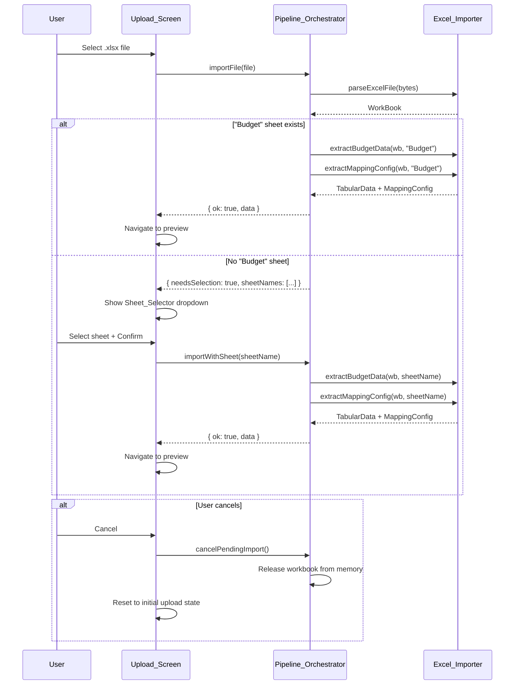

# Design Document: Dynamic Sheet Selection

## Overview

This design adds dynamic sheet selection to the Excel import flow. Currently, `extractBudgetData` and `extractMappingConfig` in `excel-importer.ts` default to a hardcoded `"Budget"` sheet name. When a workbook lacks that sheet, the user gets a `ParseError` with no recovery path.

The change introduces a two-phase import: the orchestrator first parses the workbook and checks for a `"Budget"` sheet. If found, the existing flow proceeds unchanged. If not, the orchestrator returns the sheet name list to the UI, which renders a `Sheet_Selector` dropdown. The user picks a sheet (or cancels), and the orchestrator re-invokes extraction with the chosen name.

### Key Design Decisions

1. **Workbook retained in orchestrator**: After `parseExcelFile`, the orchestrator holds the `XLSX.WorkBook` in memory so the user can select a sheet without re-parsing the file. The workbook is released on cancel or successful extraction.
2. **No new API types**: The sheet name list is a plain `string[]` — no new Pydantic/OpenAPI types needed. This is purely a frontend concern.
3. **Result-based signaling**: A new `SheetSelectionNeeded` result variant signals the UI that user input is required, keeping the orchestrator's error-or-success pattern intact.
4. **Minimal UI component**: The `Sheet_Selector` is a simple `<select>` + two buttons, consistent with the existing plain-DOM approach in `upload.ts`. No ui5-select needed for this minimal dropdown.

## Architecture



## Components and Interfaces

### Modified: Excel_Importer (`frontend/src/import/excel-importer.ts`)

No changes to the public API. `extractBudgetData` and `extractMappingConfig` already accept an optional `sheetName` parameter (defaulting to `"Budget"`). The orchestrator will pass the user-selected name explicitly.

New exported helper:

```typescript
/**
 * Get the list of sheet names from a parsed workbook.
 * Returns an empty array if the workbook has no sheets.
 */
export function getSheetNames(workbook: XLSX.WorkBook): string[] {
  return workbook.SheetNames;
}

/**
 * Check whether a specific sheet exists in the workbook.
 */
export function hasSheet(workbook: XLSX.WorkBook, name: string): boolean {
  return workbook.SheetNames.includes(name);
}
```

### Modified: Pipeline_Orchestrator (`frontend/src/pipeline/orchestrator.ts`)

New result type and methods:

```typescript
/** Returned when the user must select a sheet before import can proceed. */
export interface SheetSelectionNeeded {
  needsSelection: true;
  sheetNames: string[];
}

export type ImportResult = Result<TabularData> | SheetSelectionNeeded;
```

New/modified methods on `PipelineOrchestrator`:

| Method | Signature | Description |
|---|---|---|
| `importFile` (modified) | `(file: File) => Promise<ImportResult>` | Returns `SheetSelectionNeeded` when no "Budget" sheet exists instead of failing |
| `importWithSheet` (new) | `(sheetName: string) => Promise<Result<TabularData>>` | Extracts data from the specified sheet using the retained workbook |
| `cancelPendingImport` (new) | `() => void` | Releases the retained workbook and resets import state |

Internal state additions:

```typescript
private _pendingWorkbook: XLSX.WorkBook | null = null;
```

### New: Sheet_Selector Component (`frontend/src/ui/components/sheet-selector.ts`)

A self-contained DOM component rendered into the upload screen's content area.

```typescript
export interface SheetSelectorOptions {
  sheetNames: string[];
  onConfirm: (sheetName: string) => void;
  onCancel: () => void;
}

/**
 * Render a sheet selection dropdown with Confirm/Cancel actions.
 * Returns the root element for insertion into the DOM.
 */
export function createSheetSelector(options: SheetSelectorOptions): HTMLElement;
```

Behavior:
- Renders a `<select>` with a disabled placeholder option ("Select a sheet…") and one `<option>` per sheet name
- "Confirm" button is disabled until a real sheet is selected
- "Cancel" button calls `onCancel` immediately
- On confirm, calls `onConfirm(selectedSheetName)`

### Modified: Upload_Screen (`frontend/src/ui/screens/upload.ts`)

The `change` event handler on the file input is updated:

1. Call `orchestrator.importFile(file)` as before
2. If result is `{ ok: true }` → navigate to preview (unchanged)
3. If result is `{ ok: false }` → show error (unchanged)
4. If result is `{ needsSelection: true, sheetNames }` → render `Sheet_Selector` into the content area
5. On confirm → call `orchestrator.importWithSheet(name)`, handle result
6. On cancel → call `orchestrator.cancelPendingImport()`, reset UI to initial state

## Data Models

No new backend types or API changes. All changes are frontend-only.

### New TypeScript Types

```typescript
// In frontend/src/pipeline/orchestrator.ts

/** Signals that the user must choose a sheet. */
export interface SheetSelectionNeeded {
  needsSelection: true;
  sheetNames: string[];
}

/** Union of possible import outcomes. */
export type ImportResult = Result<TabularData> | SheetSelectionNeeded;

/** Type guard for SheetSelectionNeeded. */
export function isSheetSelectionNeeded(
  result: ImportResult
): result is SheetSelectionNeeded {
  return "needsSelection" in result && result.needsSelection === true;
}
```

### State Changes in PipelineOrchestrator

| Field | Type | Purpose |
|---|---|---|
| `_pendingWorkbook` | `XLSX.WorkBook \| null` | Retained workbook when sheet selection is needed; released on confirm/cancel/reset |

The existing `reset()` method is updated to also release `_pendingWorkbook`.


## Correctness Properties

*A property is a characteristic or behavior that should hold true across all valid executions of a system — essentially, a formal statement about what the system should do. Properties serve as the bridge between human-readable specifications and machine-verifiable correctness guarantees.*

### Property 1: Auto-import when Budget sheet exists

*For any* workbook that contains a sheet named "Budget" (possibly among other sheets), calling `importFile` SHALL return a successful `Result<TabularData>` (not a `SheetSelectionNeeded`), and the extracted data's `metadata.sourceName` SHALL equal `"Budget"`.

**Validates: Requirements 1.1, 1.2**

### Property 2: Sheet name list identity

*For any* workbook that does not contain a sheet named "Budget", calling `importFile` SHALL return a `SheetSelectionNeeded` result whose `sheetNames` array is identical (same elements, same order) to `workbook.SheetNames`.

**Validates: Requirements 2.1, 2.2, 2.3**

### Property 3: Sheet selector renders all provided names

*For any* non-empty array of sheet name strings, rendering a `Sheet_Selector` with that array SHALL produce a `<select>` element containing exactly one `<option>` per sheet name, in the same order, with no additions or omissions (excluding the placeholder option).

**Validates: Requirements 3.2**

### Property 4: Import with selected sheet extracts correct data

*For any* workbook and *for any* sheet name that exists in that workbook and is non-empty, calling `importWithSheet(sheetName)` SHALL return a successful `Result<TabularData>` whose `metadata.sourceName` equals the provided `sheetName`.

**Validates: Requirements 4.1, 4.2**

### Property 5: Cancel releases pending workbook

*For any* workbook held in the orchestrator's pending state (after an `importFile` that returned `SheetSelectionNeeded`), calling `cancelPendingImport()` SHALL set the internal `_pendingWorkbook` to `null`.

**Validates: Requirements 5.3**

## Error Handling

| Scenario | Component | Behavior |
|---|---|---|
| File has zero sheets | `Excel_Importer` / `getSheetNames` | Returns empty `string[]`; orchestrator returns `{ ok: false, error: "Workbook contains no sheets" }` |
| User-selected sheet is empty (no rows) | `extractBudgetData` | Returns `ParseError` with message `"Sheet '<name>' is empty"` (existing behavior) |
| User-selected sheet lacks required columns | `extractMappingConfig` | Returns `MappingError` with `missingColumns` list (existing behavior) |
| Extraction fails after sheet selection | `Upload_Screen` | Shows error banner, returns to sheet selector (user can pick another sheet or cancel) |
| `importWithSheet` called without pending workbook | `PipelineOrchestrator` | Returns `{ ok: false, error: "No pending workbook. Call importFile() first." }` |
| `cancelPendingImport` called without pending workbook | `PipelineOrchestrator` | No-op (safe to call anytime) |

## Testing Strategy

### Unit Tests (Vitest)

Specific examples and edge cases:

- **Sheet_Selector component**: Confirm button disabled on initial render (3.5); Confirm button enabled after selection; Cancel calls `onCancel` (3.4); Confirm calls `onConfirm` with correct name (3.3)
- **Upload_Screen integration**: Sheet selector appears when `SheetSelectionNeeded` returned (3.1); Cancel resets to initial state (5.1, 5.2); Error after sheet selection returns to selector (6.2)
- **Edge cases**: Workbook with zero sheets returns error (6.1); Empty selected sheet returns descriptive error (4.3); `importWithSheet` without pending workbook returns error

### Property-Based Tests (fast-check + Vitest)

Each correctness property is implemented as a single property-based test with a minimum of 100 iterations. Tests use `fast-check` (already installed in the project).

Tag format: `Feature: dynamic-sheet-selection, Property {N}: {title}`

| Property | Test Description | Generator Strategy |
|---|---|---|
| Property 1 | Generate workbooks with a "Budget" sheet + random other sheets; verify auto-import succeeds | `fc.array(fc.string())` for extra sheet names, always include "Budget" |
| Property 2 | Generate workbooks without "Budget"; verify returned sheet names match exactly | `fc.array(fc.string().filter(s => s !== "Budget"), { minLength: 1 })` |
| Property 3 | Generate random string arrays; render selector; count `<option>` elements | `fc.array(fc.string({ minLength: 1 }), { minLength: 1 })` |
| Property 4 | Generate workbooks with multiple non-empty sheets; pick random sheet; verify extraction | `fc.record` with sheet names and cell data |
| Property 5 | Generate workbooks; trigger pending state; cancel; verify null | Reuse workbook generators from Property 1/2 |

Each property test must reference its design property in a comment:
```typescript
// Feature: dynamic-sheet-selection, Property 1: Auto-import when Budget sheet exists
```
