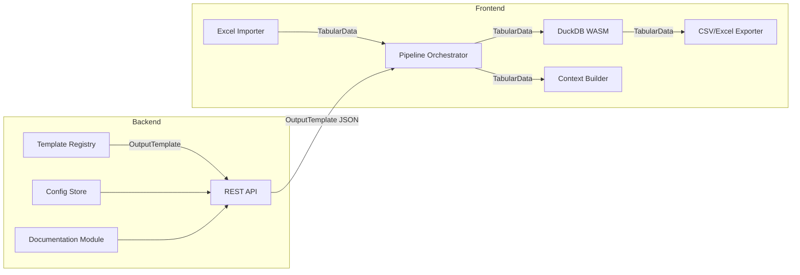
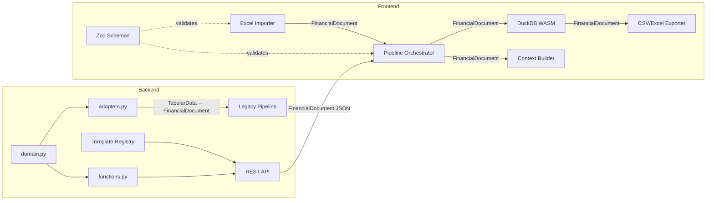
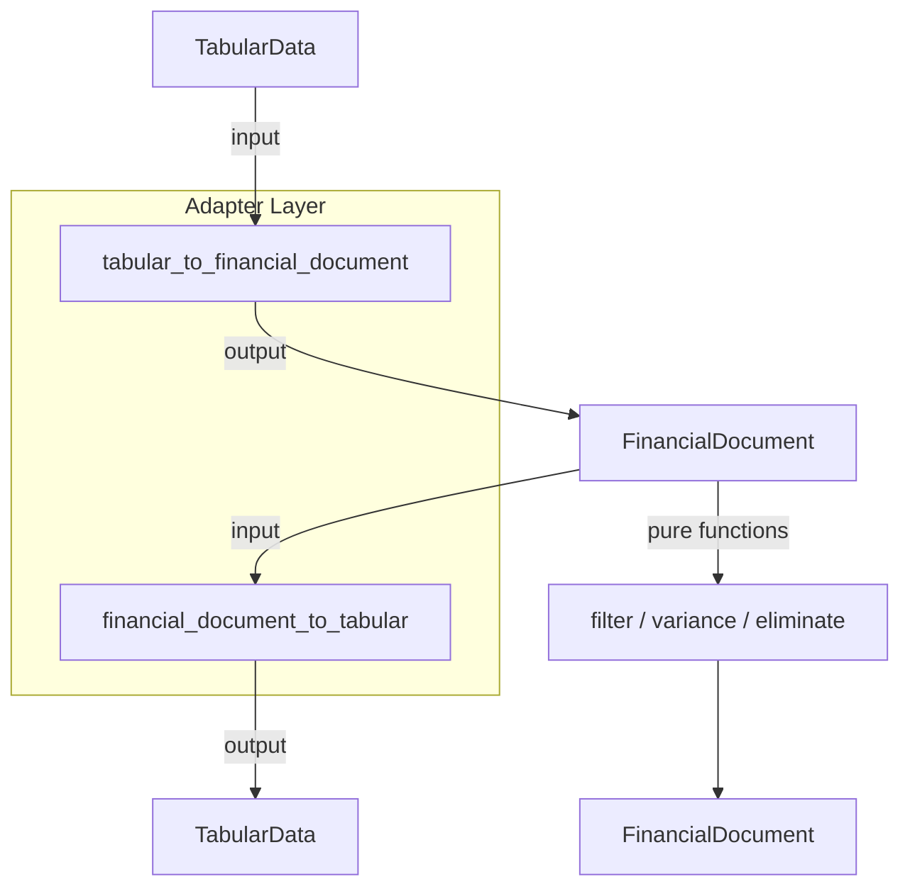

# Design Document: Financial Domain Model

## Overview

This design describes the refactoring of the fintran codebase from its current generic `TabularData` / `ColumnDef` / `Row` internal representation to a typed Financial Domain Model. The refactoring introduces:

- **Backend**: Immutable Pydantic models (`frozen=True`) in `backend/app/core/domain.py` for all financial concepts, with `FinancialDocument` as the canonical intermediate representation (IR).
- **Frontend**: Zod schemas in `frontend/src/types/domain.ts` mirroring the backend models, with inferred TypeScript types.
- **Pure Function Layer**: Stateless functions in `backend/app/core/functions.py` for filtering, variance computation, intercompany elimination, and Polars conversion.
- **Adapter Layer**: Bidirectional converters between `TabularData` and `FinancialDocument` in `backend/app/core/adapters.py` to enable incremental migration.

The existing pipeline flow (Excel import → DuckDB transform → CSV/Excel export) continues to work throughout the migration via the adapter layer. Once all consumers are migrated, the adapter layer and `TabularData` references are removed.

### Key Design Decisions

1. **Single `domain.py` module**: All backend domain types live in one module to avoid circular imports and make the domain boundary explicit. The existing `types.py` remains untouched during migration.
2. **Zod over auto-generated types**: The frontend currently uses OpenAPI-generated types (`api.d.ts`). The new domain types use Zod for runtime validation, coexisting with the generated types until migration is complete.
3. **Tuples for collections**: `FinancialDocument` uses `tuple` (not `list`) for `lines`, `accounts`, `entities` to enforce immutability at the collection level.
4. **Decimal as string in JSON**: `Decimal` values serialize as strings in JSON to preserve precision across the API boundary. Zod schemas parse these as strings and convert to `number` only at computation boundaries.
5. **Adapter-first migration**: The adapter layer allows each pipeline stage to be migrated independently without breaking the existing flow.

## Architecture

### Current Architecture



### Target Architecture



### Migration Architecture (Transitional)



## Components and Interfaces

### Backend Components

#### 1. `backend/app/core/domain.py` — Domain Model Types

Contains all immutable Pydantic models. No business logic, no I/O.

```python
# Primitive types
AccountCode = NewType("AccountCode", str)
EntityCode = NewType("EntityCode", str)

# Enums
class LineType(StrEnum): ...
class AccountType(StrEnum): ...
class DebitCredit(StrEnum): ...

# Dimension models (frozen=True)
class Account(BaseModel, frozen=True): ...
class Entity(BaseModel, frozen=True): ...
class Period(BaseModel, frozen=True): ...

# Core line types (frozen=True)
class FinancialLine(BaseModel, frozen=True): ...
class BudgetLine(FinancialLine, frozen=True): ...
class ActualLine(FinancialLine, frozen=True): ...
class ForecastLine(FinancialLine, frozen=True): ...

# Statement lines — computed, never stored (frozen=True)
class IncomeStatementLine(BaseModel, frozen=True): ...
class BalanceSheetLine(BaseModel, frozen=True): ...
class CashflowLine(BaseModel, frozen=True): ...

# Top-level IR
class FinancialDocument(BaseModel, frozen=True):
    lines: tuple[FinancialLine, ...]
    accounts: tuple[Account, ...]
    entities: tuple[Entity, ...]
    meta: dict[str, str]
```

#### 2. `backend/app/core/functions.py` — Pure Function Layer

Stateless functions operating on `FinancialDocument`. No side effects, no I/O.

```python
def filter_entity(doc: FinancialDocument, entity: EntityCode) -> FinancialDocument: ...
def filter_period(doc: FinancialDocument, year: int) -> FinancialDocument: ...
def compute_variance(doc: FinancialDocument) -> list[IncomeStatementLine]: ...
def eliminate_intercompany(doc: FinancialDocument, elim: EntityCode) -> FinancialDocument: ...
def to_polars(doc: FinancialDocument) -> pl.DataFrame: ...
def from_polars(df: pl.DataFrame) -> FinancialDocument: ...
```

#### 3. `backend/app/core/adapters.py` — Migration Adapter Layer

Bidirectional converters between `TabularData` and `FinancialDocument`.

```python
def tabular_to_financial_document(
    data: TabularData, mapping: MappingConfig, params: UserParams
) -> FinancialDocument: ...

def financial_document_to_tabular(
    doc: FinancialDocument, template: OutputTemplate
) -> TabularData: ...
```

### Frontend Components

#### 4. `frontend/src/types/domain.ts` — Zod Schemas + TypeScript Types

Mirrors the backend domain model with Zod runtime validation.

```typescript
// Enums
export const LineTypeSchema = z.enum(["budget", "actual", "forecast"]);
export const AccountTypeSchema = z.enum(["asset", "liability", "equity", "revenue", "expense"]);
export const DebitCreditSchema = z.enum(["D", "C"]);

// Dimension models
export const AccountSchema = z.object({ ... }).readonly();
export const EntitySchema = z.object({ ... }).readonly();

// Line types
export const FinancialLineSchema = z.object({ ... }).readonly();
export const BudgetLineSchema = FinancialLineSchema.extend({ ... }).readonly();

// Top-level IR
export const FinancialDocumentSchema = z.object({
  lines: z.array(FinancialLineSchema).readonly(),
  accounts: z.array(AccountSchema).readonly(),
  entities: z.array(EntitySchema).readonly(),
  meta: z.record(z.string()),
}).readonly();

// Inferred types
export type FinancialDocument = z.infer<typeof FinancialDocumentSchema>;
export type FinancialLine = z.infer<typeof FinancialLineSchema>;
// ... etc
```

#### 5. Frontend Pipeline Changes

The following existing modules will be updated to consume/produce `FinancialDocument`:

- `frontend/src/import/excel-importer.ts` — produces `FinancialDocument` instead of `TabularData`
- `frontend/src/pipeline/orchestrator.ts` — passes `FinancialDocument` between stages
- `frontend/src/export/csv-excel-exporter.ts` — consumes `FinancialDocument`
- `frontend/src/pipeline/context-builder.ts` — consumes `FinancialDocument`

### Interface Contracts

| Boundary | Producer | Consumer | Data Type |
|---|---|---|---|
| Excel import → Pipeline | Excel Importer | Orchestrator | `FinancialDocument` |
| Pipeline → Transform | Orchestrator | DuckDB WASM | `FinancialDocument` (via `to_polars`) |
| Transform → Export | DuckDB WASM | CSV/Excel Exporter | `FinancialDocument` |
| Backend → Frontend | REST API | Frontend | `FinancialDocument` JSON |
| Legacy bridge | Adapter | Existing code | `TabularData ↔ FinancialDocument` |

## Data Models

### Backend Domain Models (Pydantic)

All models use `frozen=True` and follow the specification in `FinancialDomainModel.md`.

#### Primitive Types

| Type | Python Definition | Example |
|---|---|---|
| `AccountCode` | `NewType("AccountCode", str)` | `"4001"` |
| `EntityCode` | `NewType("EntityCode", str)` | `"MS"`, `"MH"`, `"EL"` |
| `Period` (NewType) | `NewType("Period", str)` | `"2025-03"` |

#### Enums

| Enum | Values |
|---|---|
| `LineType` | `"budget"`, `"actual"`, `"forecast"` |
| `AccountType` | `"asset"`, `"liability"`, `"equity"`, `"revenue"`, `"expense"` |
| `DebitCredit` | `"D"`, `"C"` |

#### Dimension Models

**Account** (`frozen=True`):
| Field | Type | Default |
|---|---|---|
| `code` | `AccountCode` | required |
| `description` | `str` | required |
| `account_type` | `AccountType` | required |
| `normal_balance` | `DebitCredit` | required |
| `parent_code` | `AccountCode \| None` | `None` |

**Entity** (`frozen=True`):
| Field | Type | Default |
|---|---|---|
| `code` | `EntityCode` | required |
| `description` | `str` | required |
| `is_elimination` | `bool` | `False` |

**Period** (`frozen=True`):
| Field | Type | Default |
|---|---|---|
| `value` | `str` | required |
| `year` | `int` | required |
| `month` | `int` | required |
| `fiscal_year` | `int` | required |

#### Core Line Types

**FinancialLine** (`frozen=True`):
| Field | Type | Default |
|---|---|---|
| `account` | `AccountCode` | required |
| `entity` | `EntityCode` | required |
| `period` | `str` | required |
| `amount` | `Decimal` | required |
| `line_type` | `LineType` | required |
| `currency` | `str` | `"EUR"` |
| `memo` | `str \| None` | `None` |

**BudgetLine** (extends `FinancialLine`, `frozen=True`):
| Field | Type | Default |
|---|---|---|
| `line_type` | `Literal[LineType.BUDGET]` | `LineType.BUDGET` |
| `version` | `str` | `"v1"` |

**ActualLine** (extends `FinancialLine`, `frozen=True`):
| Field | Type | Default |
|---|---|---|
| `line_type` | `Literal[LineType.ACTUAL]` | `LineType.ACTUAL` |
| `journal_ref` | `str \| None` | `None` |

**ForecastLine** (extends `FinancialLine`, `frozen=True`):
| Field | Type | Default |
|---|---|---|
| `line_type` | `Literal[LineType.FORECAST]` | `LineType.FORECAST` |
| `basis` | `Literal["manual", "actuals_adjusted", "budget_adjusted"]` | `"manual"` |

#### Statement Lines (computed, never stored)

**IncomeStatementLine** (`frozen=True`):
| Field | Type |
|---|---|
| `account` | `AccountCode` |
| `entity` | `EntityCode` |
| `period` | `str` |
| `budget` | `Decimal` |
| `actual` | `Decimal` |
| `forecast` | `Decimal` |
| `variance_bva` | `Decimal` |
| `variance_bvf` | `Decimal` |

**BalanceSheetLine** (`frozen=True`):
| Field | Type |
|---|---|
| `account` | `AccountCode` |
| `entity` | `EntityCode` |
| `period` | `str` |
| `balance` | `Decimal` |
| `line_type` | `LineType` |

**CashflowLine** (`frozen=True`):
| Field | Type |
|---|---|
| `account` | `AccountCode` |
| `entity` | `EntityCode` |
| `period` | `str` |
| `inflow` | `Decimal` |
| `outflow` | `Decimal` |
| `net` | `Decimal` |
| `line_type` | `LineType` |

#### Top-Level IR

**FinancialDocument** (`frozen=True`):
| Field | Type |
|---|---|
| `lines` | `tuple[FinancialLine, ...]` |
| `accounts` | `tuple[Account, ...]` |
| `entities` | `tuple[Entity, ...]` |
| `meta` | `dict[str, str]` |

### Frontend Domain Models (Zod)

The Zod schemas mirror the backend models exactly. Key differences:

- `Decimal` → `z.string()` (preserves precision; converted to `number` only at computation boundaries)
- `tuple` → `z.array().readonly()` (TypeScript `readonly` arrays)
- `frozen=True` → `.readonly()` on object schemas (produces `Readonly<>` types)
- `NewType` → branded `z.string()` with `.brand<"AccountCode">()` etc.

### JSON Serialization Format

`FinancialDocument` serializes to JSON with these conventions:

```json
{
  "lines": [
    {
      "account": "4001",
      "entity": "MS",
      "period": "2025-01",
      "amount": "15000.50",
      "line_type": "budget",
      "currency": "EUR",
      "memo": null
    }
  ],
  "accounts": [
    {
      "code": "4001",
      "description": "Revenue",
      "account_type": "revenue",
      "normal_balance": "C",
      "parent_code": null
    }
  ],
  "entities": [
    {
      "code": "MS",
      "description": "Main Site",
      "is_elimination": false
    }
  ],
  "meta": {
    "source": "budget_2025.xlsx"
  }
}
```

`Decimal` values are serialized as JSON strings (e.g., `"15000.50"`) to avoid floating-point precision loss.

## Correctness Properties

*A property is a characteristic or behavior that should hold true across all valid executions of a system — essentially, a formal statement about what the system should do. Properties serve as the bridge between human-readable specifications and machine-verifiable correctness guarantees.*

### Property 1: Immutability enforcement across all domain models

*For any* domain model instance (Account, Entity, Period, FinancialLine, BudgetLine, ActualLine, ForecastLine, IncomeStatementLine, BalanceSheetLine, CashflowLine, FinancialDocument) and *for any* field on that instance, attempting to assign a new value to the field shall raise a `ValidationError`.

**Validates: Requirements 1.3, 1.6, 1.8, 10.1**

### Property 2: Specialised line type Literal constraint

*For any* `BudgetLine` instance, its `line_type` field shall equal `"budget"`; *for any* `ActualLine` instance, its `line_type` shall equal `"actual"`; *for any* `ForecastLine` instance, its `line_type` shall equal `"forecast"`. Constructing a specialised line with a mismatched `line_type` shall raise a `ValidationError`.

**Validates: Requirements 1.5**

### Property 3: FinancialDocument uses tuples for collection fields

*For any* valid `FinancialDocument` instance, the `lines`, `accounts`, and `entities` fields shall be of type `tuple`, not `list`.

**Validates: Requirements 1.7, 10.3**

### Property 4: model_copy produces a new instance with updated fields

*For any* frozen domain model instance and *for any* valid field update, calling `model_copy(update={field: new_value})` shall return a new instance where the specified field equals `new_value` and all other fields remain unchanged. The original instance shall be unmodified.

**Validates: Requirements 10.2**

### Property 5: Zod schema accepts all valid backend-produced FinancialDocument JSON

*For any* valid `FinancialDocument` instance produced by the backend, serializing it to JSON via `model_dump_json()` and parsing the result with the frontend `FinancialDocumentSchema` Zod schema shall succeed without errors.

**Validates: Requirements 2.2, 2.4, 8.5**

### Property 6: Zod validation surfaces descriptive errors for invalid payloads

*For any* JSON payload that violates the `FinancialDocument` Zod schema (e.g., missing required field, wrong type), the Zod parse error shall contain the name of the invalid field and the expected type.

**Validates: Requirements 2.5**

### Property 7: Backend JSON serialization round-trip

*For any* valid `FinancialDocument` instance, serializing to JSON via `model_dump_json()` and deserializing back via `model_validate_json()` shall produce a `FinancialDocument` equal to the original.

**Validates: Requirements 8.1, 8.2, 8.3**

### Property 8: Polars conversion round-trip

*For any* valid `FinancialDocument` instance, calling `from_polars(to_polars(doc))` shall produce a `FinancialDocument` with lines equivalent to the original (field values preserved).

**Validates: Requirements 6.5, 6.6, 6.7**

### Property 9: filter_entity returns only matching lines and preserves metadata

*For any* `FinancialDocument` and *for any* `EntityCode`, calling `filter_entity(doc, entity)` shall return a `FinancialDocument` where every line has `entity` equal to the specified code, and the `accounts`, `entities`, and `meta` fields are identical to the original.

**Validates: Requirements 6.1, 6.8**

### Property 10: filter_period returns only matching year lines

*For any* `FinancialDocument` and *for any* year (int), calling `filter_period(doc, year)` shall return a `FinancialDocument` where every line's `period` starts with the string representation of that year.

**Validates: Requirements 6.2**

### Property 11: compute_variance produces correct variance values

*For any* `FinancialDocument` containing budget, actual, and/or forecast lines, calling `compute_variance(doc)` shall return `IncomeStatementLine` instances where `variance_bva` equals `actual - budget` and `variance_bvf` equals `forecast - budget` for each unique account/entity/period combination. Missing line types shall use `Decimal("0")`.

**Validates: Requirements 6.3, 6.9**

### Property 12: eliminate_intercompany removes elimination entity lines

*For any* `FinancialDocument` and *for any* elimination `EntityCode`, calling `eliminate_intercompany(doc, elim)` shall return a `FinancialDocument` where no line has `entity` equal to the elimination code.

**Validates: Requirements 6.4**

### Property 13: Writer output row count matches FinancialDocument lines

*For any* `FinancialDocument` with N lines and *for any* `OutputTemplate`, the CSV writer shall produce exactly N data rows (plus one header row), and the Excel writer shall produce exactly N data rows (plus one header row).

**Validates: Requirements 3.2, 3.3, 5.1, 5.2, 7.3, 7.4**

### Property 14: Writer from_source mapping extracts correct field values

*For any* `FinancialLine` and *for any* `from_source` column mapping referencing a valid FinancialLine field name, the writer shall extract the value of that field from the line.

**Validates: Requirements 5.3**

### Property 15: Writer period_number transform extracts correct period

*For any* `FinancialLine` with a period in `"YYYY-MM"` format, the `period_number` transform shall extract the month number (1–12) from the period string.

**Validates: Requirements 5.4**

### Property 16: Writer DC split produces correct debit/credit based on normal_balance

*For any* `FinancialLine` with a positive amount and *for any* `Account` with a known `normal_balance`, the DC-based transform shall place the amount in the debit column when `normal_balance` is `"D"` and in the credit column when `normal_balance` is `"C"`, with the other column as null.

**Validates: Requirements 5.5**

### Property 17: Adapter TabularData round-trip preserves data values

*For any* valid `TabularData` with valid `MappingConfig` and `UserParams`, converting to `FinancialDocument` via `tabular_to_financial_document` and back to `TabularData` via `financial_document_to_tabular` shall preserve the data values (modulo type normalization of cell values to strings).

**Validates: Requirements 11.3, 11.4, 11.5**

## Error Handling

### Backend Error Handling

| Error Condition | Handling Strategy | Source |
|---|---|---|
| Field assignment on frozen model | Pydantic raises `ValidationError` automatically | Req 1.8 |
| Invalid field type during model construction | Pydantic raises `ValidationError` with field name and expected type | Req 1.3–1.7 |
| BudgetLine constructed with wrong line_type | Pydantic `Literal` validation raises `ValidationError` | Req 1.5 |
| Empty/unreadable Excel file | Reader raises `ParseError` (no partial `FinancialDocument` produced) | Req 4.4 |
| Missing account code in Excel row | Reader skips row, records warning in `meta["warnings"]` | Req 4.2 |
| Non-numeric month column value | Reader treats as `Decimal("0")`, records warning in `meta["warnings"]` | Req 4.3 |
| Invalid JSON during deserialization | `model_validate_json()` raises `ValidationError` | Req 8.2 |
| Adapter receives TabularData with unmappable columns | Adapter raises `ValueError` with descriptive message | Req 11.3 |

### Frontend Error Handling

| Error Condition | Handling Strategy | Source |
|---|---|---|
| Invalid FinancialDocument JSON from API | Zod `.safeParse()` returns error with field path and expected type | Req 2.4, 2.5 |
| Excel file with no Budget sheet | `ParseError` with available sheet names (existing behavior preserved) | Req 4.4 |
| Missing required columns in Excel | `MappingError` with missing/available column lists (existing behavior preserved) | Req 4.2 |

### Error Propagation

- Backend pure functions (`functions.py`) do not catch exceptions — they propagate to the caller.
- Adapter functions validate inputs and raise `ValueError` for unmappable data.
- Frontend Zod validation uses `.safeParse()` to avoid throwing; errors are returned as structured objects.
- The pipeline orchestrator's existing `Result<T>` pattern (ok/error union) is preserved for all pipeline stages.

## Testing Strategy

### Testing Framework

| Layer | Framework | Property Testing Library |
|---|---|---|
| Backend (Python) | pytest | Hypothesis (already in dev dependencies) |
| Frontend (TypeScript) | Vitest | fast-check (already in dev dependencies) |

### Property-Based Tests

Each correctness property maps to a single property-based test. Tests use Hypothesis (backend) or fast-check (frontend) to generate random valid inputs and verify the property holds across at least 100 iterations.

Each test is tagged with a comment referencing the design property:

```python
# Feature: financial-domain-model, Property 7: Backend JSON serialization round-trip
@given(doc=financial_document_strategy())
def test_json_round_trip(doc: FinancialDocument):
    assert FinancialDocument.model_validate_json(doc.model_dump_json()) == doc
```

```typescript
// Feature: financial-domain-model, Property 5: Zod schema accepts all valid backend-produced FinancialDocument JSON
test.prop([financialDocumentArbitrary], (doc) => {
  const json = JSON.stringify(doc);
  const result = FinancialDocumentSchema.safeParse(JSON.parse(json));
  expect(result.success).toBe(true);
}, { numRuns: 100 });
```

### Property Test Mapping

| Property | Test Location | Library |
|---|---|---|
| 1: Immutability enforcement | `backend/tests/test_property_domain_immutability.py` | Hypothesis |
| 2: Literal constraint | `backend/tests/test_property_domain_literals.py` | Hypothesis |
| 3: Tuple collections | `backend/tests/test_property_domain_collections.py` | Hypothesis |
| 4: model_copy | `backend/tests/test_property_domain_copy.py` | Hypothesis |
| 5: Zod accepts backend JSON | `frontend/tests/types/test_property_domain_zod.test.ts` | fast-check |
| 6: Zod error messages | `frontend/tests/types/test_property_domain_zod.test.ts` | fast-check |
| 7: JSON round-trip | `backend/tests/test_property_domain_serialization.py` | Hypothesis |
| 8: Polars round-trip | `backend/tests/test_property_functions_polars.py` | Hypothesis |
| 9: filter_entity | `backend/tests/test_property_functions_filter.py` | Hypothesis |
| 10: filter_period | `backend/tests/test_property_functions_filter.py` | Hypothesis |
| 11: compute_variance | `backend/tests/test_property_functions_variance.py` | Hypothesis |
| 12: eliminate_intercompany | `backend/tests/test_property_functions_eliminate.py` | Hypothesis |
| 13: Writer row count | `backend/tests/test_property_writers.py` | Hypothesis |
| 14: from_source mapping | `backend/tests/test_property_writers.py` | Hypothesis |
| 15: period_number transform | `backend/tests/test_property_writers.py` | Hypothesis |
| 16: DC split | `backend/tests/test_property_writers.py` | Hypothesis |
| 17: Adapter round-trip | `backend/tests/test_property_adapters.py` | Hypothesis |

### Unit Tests

Unit tests complement property tests by covering:

- Specific examples with known inputs/outputs (e.g., a concrete budget Excel file producing expected FinancialDocument)
- Edge cases identified in prework (missing account codes, non-numeric month values, empty files)
- Integration points (API endpoint responses, template registry lookups)
- Backward compatibility regression tests (same input → same output as pre-refactoring)

Unit tests should be kept minimal — property tests handle broad input coverage. Focus unit tests on:

1. Concrete regression examples (Req 9.1, 9.2)
2. API endpoint compatibility (Req 9.3)
3. Reader edge cases (Req 4.2, 4.3, 4.4)
4. Enum value correctness (Req 1.2)

### Hypothesis Strategies

Custom Hypothesis strategies will be defined for generating valid domain model instances:

```python
# backend/tests/strategies.py
from hypothesis import strategies as st
from backend.app.core.domain import *

account_codes = st.from_regex(r"[0-9]{4}", fullmatch=True).map(AccountCode)
entity_codes = st.sampled_from(["MS", "MH", "EL", "IC"]).map(EntityCode)
periods = st.from_regex(r"20[2-3][0-9]-(0[1-9]|1[0-2])", fullmatch=True)
amounts = st.decimals(min_value=-1_000_000, max_value=1_000_000, places=4, allow_nan=False, allow_infinity=False)

financial_lines = st.builds(FinancialLine, account=account_codes, entity=entity_codes, period=periods, amount=amounts, line_type=st.sampled_from(LineType))
budget_lines = st.builds(BudgetLine, account=account_codes, entity=entity_codes, period=periods, amount=amounts)
# ... etc

financial_documents = st.builds(FinancialDocument,
    lines=st.lists(financial_lines, max_size=50).map(tuple),
    accounts=st.lists(accounts, max_size=10).map(tuple),
    entities=st.lists(entities, max_size=5).map(tuple),
    meta=st.dictionaries(st.text(max_size=20), st.text(max_size=100), max_size=5),
)
```

### fast-check Arbitraries

```typescript
// frontend/tests/arbitraries/domain.ts
import fc from "fast-check";

export const accountCodeArb = fc.stringMatching(/^[0-9]{4}$/);
export const entityCodeArb = fc.constantFrom("MS", "MH", "EL", "IC");
export const periodArb = fc.stringMatching(/^20[2-3][0-9]-(0[1-9]|1[0-2])$/);
export const amountArb = fc.float({ min: -1_000_000, max: 1_000_000, noNaN: true }).map(v => v.toFixed(4));
// ... etc
```

### Test Configuration

- Hypothesis: `@settings(max_examples=100)` on all property tests
- fast-check: `{ numRuns: 100 }` on all property tests
- Both libraries are already present in the project's dev dependencies
