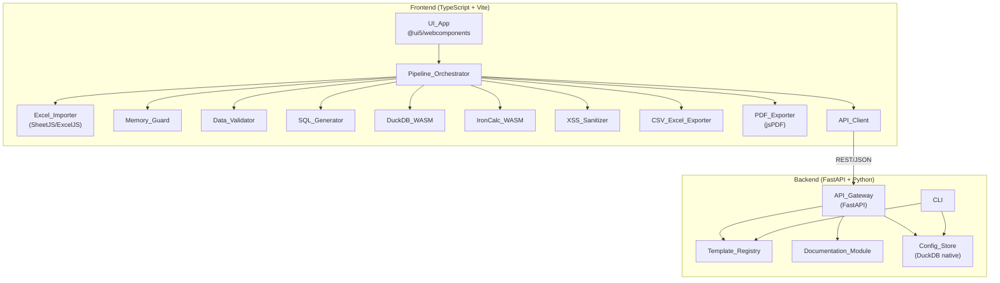
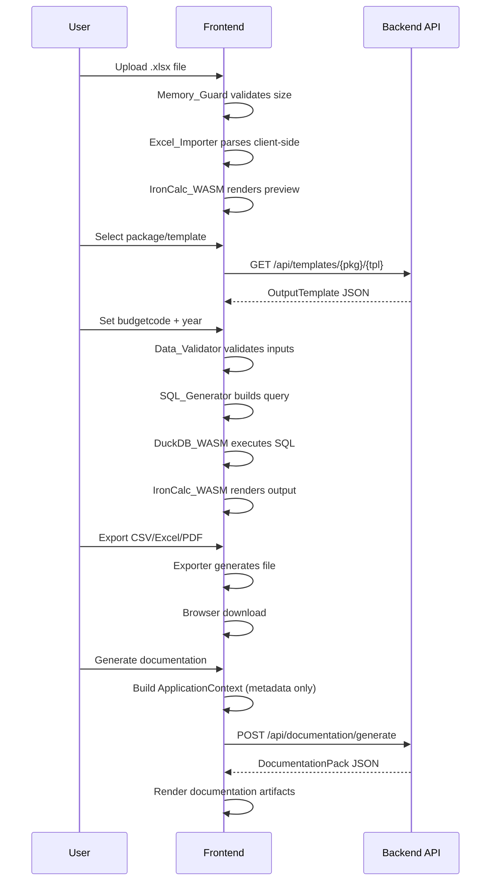

# Design Document: Frontend-Backend Split

## Overview

This design splits the current monolithic Python data conversion tool into a two-tier architecture:

- **Backend**: A FastAPI Python server owning template definitions, documentation generation, customer configuration persistence (DuckDB native), and the CLI.
- **Frontend**: A plain TypeScript browser application (Vite + @ui5/webcomponents) owning all data processing: Excel import, DuckDB-WASM transformation, IronCalc-WASM rendering, validation, export (CSV/Excel/PDF), and the UI shell.

The core contract between the two tiers flows from Pydantic models → auto-generated OpenAPI spec → openapi-typescript → TypeScript types. Raw financial data never leaves the browser; only metadata/aggregates are sent to the backend for documentation generation.

### Key Design Decisions

1. **Pydantic as single source of truth**: All shared domain types are defined as Pydantic models on the backend. The existing `dataclass`-based types in `src/core/types.py` are converted to Pydantic `BaseModel` subclasses.
2. **DuckDB dual usage**: Native Python DuckDB on the backend for config persistence; DuckDB-WASM in the browser for SQL transformation. No SQLite.
3. **No framework**: The frontend uses plain TypeScript with @ui5/webcomponents. No React, Vue, Angular, or full SAP UI5.
4. **Ephemeral frontend**: All user/financial data lives only in browser memory. No localStorage, no IndexedDB, no server transmission of financial data.
5. **PDF export client-side**: Uses jsPDF or pdf-lib in the browser, replacing the current Python fpdf2-based exporter.
6. **Documentation generation server-side**: The existing Python documentation module stays on the backend, invoked via API with an `ApplicationContext` payload.

## Architecture



### Data Flow



## Components and Interfaces

### Backend Components

#### 1. API_Gateway (`backend/app/main.py`)

The FastAPI application entry point. Mounts all routers and serves the OpenAPI spec.

```python
# backend/app/main.py
from fastapi import FastAPI
from backend.app.routers import templates, documentation, configurations

app = FastAPI(title="Data Conversion Tool API", version="1.0.0")
app.include_router(templates.router, prefix="/api/templates", tags=["templates"])
app.include_router(documentation.router, prefix="/api/documentation", tags=["documentation"])
app.include_router(configurations.router, prefix="/api/configurations", tags=["configurations"])
```

#### 2. Template Registry Router (`backend/app/routers/templates.py`)

Exposes the existing template registry over REST.

| Endpoint | Method | Response | Description |
|---|---|---|---|
| `/api/templates/packages` | GET | `PackageListResponse` | List available package names |
| `/api/templates/packages/{package}/templates` | GET | `TemplateListResponse` | List template names for a package |
| `/api/templates/packages/{package}/templates/{template}` | GET | `OutputTemplateResponse` | Full template definition |

#### 3. Documentation Router (`backend/app/routers/documentation.py`)

| Endpoint | Method | Request Body | Response | Description |
|---|---|---|---|---|
| `/api/documentation/generate` | POST | `ApplicationContext` | `DocumentationPack` | Generate all 7 artifacts |

#### 4. Configuration Router (`backend/app/routers/configurations.py`)

| Endpoint | Method | Request/Response | Description |
|---|---|---|---|
| `/api/configurations` | GET | `ConfigurationListResponse` | List all saved configurations |
| `/api/configurations` | POST | `CreateConfigurationRequest` → `ConfigurationResponse` | Create a new configuration |
| `/api/configurations/{name}` | GET | `ConfigurationResponse` | Get configuration by name |
| `/api/configurations/{name}` | PUT | `UpdateConfigurationRequest` → `ConfigurationResponse` | Update a configuration |
| `/api/configurations/{name}` | DELETE | 204 No Content | Delete a configuration |

#### 5. Config_Store (`backend/app/persistence/config_store.py`)

DuckDB-based persistence layer for customer configurations.

```python
class ConfigStore:
    def __init__(self, db_path: str = "data/config.duckdb"):
        self.db_path = db_path
        self._ensure_schema()

    def _ensure_schema(self) -> None:
        """Create tables if they don't exist."""
        ...

    def create(self, config: CustomerConfiguration) -> CustomerConfiguration: ...
    def get(self, name: str) -> CustomerConfiguration | None: ...
    def list_all(self) -> list[CustomerConfiguration]: ...
    def update(self, name: str, config: UpdateConfigurationRequest) -> CustomerConfiguration: ...
    def delete(self, name: str) -> bool: ...
```

#### 6. Documentation Module (`backend/app/documentation/`)

Direct port of the existing `src/documentation/` package. No changes to internal logic — only the types it consumes change from dataclasses to Pydantic models.

#### 7. CLI (`backend/app/cli.py`)

Direct port of `src/cli.py`. Uses the same Pydantic core types and template registry. Remains a backend-only dev/ops tool.

### Frontend Components

#### 8. API_Client (`frontend/src/api/client.ts`)

Typed HTTP client using `fetch` and the generated TypeScript types.

```typescript
// frontend/src/api/client.ts
import type { OutputTemplate, ApplicationContext, DocumentationPack, CustomerConfiguration } from '../types/api';

const BASE_URL = import.meta.env.VITE_API_URL || 'http://localhost:8000';

export async function getPackages(): Promise<string[]> { ... }
export async function getTemplates(pkg: string): Promise<string[]> { ... }
export async function getTemplate(pkg: string, tpl: string): Promise<OutputTemplate> { ... }
export async function generateDocumentation(ctx: ApplicationContext): Promise<DocumentationPack> { ... }
export async function listConfigurations(): Promise<CustomerConfiguration[]> { ... }
export async function getConfiguration(name: string): Promise<CustomerConfiguration> { ... }
export async function createConfiguration(config: CreateConfigurationRequest): Promise<CustomerConfiguration> { ... }
export async function updateConfiguration(name: string, config: UpdateConfigurationRequest): Promise<CustomerConfiguration> { ... }
export async function deleteConfiguration(name: string): Promise<void> { ... }
```

#### 9. Pipeline_Orchestrator (`frontend/src/pipeline/orchestrator.ts`)

Coordinates the full client-side flow. Holds the session state (all in-memory, ephemeral).

```typescript
// frontend/src/pipeline/orchestrator.ts
export class PipelineOrchestrator {
    private sourceData: TabularData | null = null;
    private mappingConfig: MappingConfig | null = null;
    private template: OutputTemplate | null = null;
    private userParams: UserParams | null = null;
    private transformResult: TabularData | null = null;

    async importFile(file: File): Promise<void> { ... }
    async selectTemplate(pkg: string, tpl: string): Promise<void> { ... }
    setParams(budgetcode: string, year: number): void { ... }
    async runTransform(): Promise<void> { ... }
    exportCSV(): Blob { ... }
    exportExcel(): Blob { ... }
    exportPDF(screenContent: ScreenCapture): Blob { ... }
    buildApplicationContext(): ApplicationContext { ... }
    async generateDocumentation(): Promise<DocumentationPack> { ... }
}
```

#### 10. Excel_Importer (`frontend/src/import/excel-importer.ts`)

Client-side .xlsx parsing using SheetJS (xlsx) or ExcelJS.

#### 11. SQL_Generator (`frontend/src/transform/sql-generator.ts`)

TypeScript port of `src/modules/excel2budget/sql_generator.py`. Generates DuckDB-compatible SELECT-only SQL.

#### 12. DuckDB_WASM Engine (`frontend/src/engine/duckdb-engine.ts`)

Wraps `@duckdb/duckdb-wasm` for in-browser SQL execution.

#### 13. IronCalc_WASM Engine (`frontend/src/engine/ironcalc-engine.ts`)

Wraps IronCalc WASM for spreadsheet rendering and preview.

#### 14. XSS_Sanitizer (`frontend/src/security/xss-sanitizer.ts`)

TypeScript port of `src/engine/ironcalc/sanitizer.py`. Strips HTML tags, script elements, event handlers, dangerous URI schemes.

#### 15. Data_Validator (`frontend/src/validation/data-validator.ts`)

TypeScript port of `src/core/validation.py`. Validates mapping config, user params, DC values.

#### 16. CSV_Excel_Exporter (`frontend/src/export/csv-excel-exporter.ts`)

Client-side CSV/Excel generation. CSV via string building; Excel via SheetJS or ExcelJS.

#### 17. PDF_Exporter (`frontend/src/export/pdf-exporter.ts`)

Client-side PDF generation using jsPDF or pdf-lib. Replaces the Python fpdf2-based exporter.

#### 18. Memory_Guard (`frontend/src/guards/memory-guard.ts`)

TypeScript port of `src/core/memory.py`. Validates file size and estimated WASM memory before parsing.

#### 19. UI_App (`frontend/src/ui/`)

Plain TypeScript + @ui5/webcomponents. Screen-based navigation:

```
frontend/src/ui/
├── app.ts              # Main app shell, screen router
├── screens/
│   ├── upload.ts       # File upload screen
│   ├── preview.ts      # Data preview with IronCalc
│   ├── configuration.ts # Template selection + params
│   ├── transform.ts    # Transformation trigger
│   ├── output.ts       # Output preview + export
│   └── documentation.ts # Documentation artifacts
└── components/
    ├── header.ts       # Date display + PDF action
    └── error-banner.ts # Error display
```

### Backend Project Structure

```
backend/
├── pyproject.toml
├── app/
│   ├── __init__.py
│   ├── main.py                    # FastAPI app entry point
│   ├── core/
│   │   ├── __init__.py
│   │   ├── types.py               # Pydantic models (converted from dataclasses)
│   │   └── validation.py          # Validation logic (ported)
│   ├── routers/
│   │   ├── __init__.py
│   │   ├── templates.py           # Template registry endpoints
│   │   ├── documentation.py       # Documentation generation endpoint
│   │   └── configurations.py      # Config CRUD endpoints
│   ├── templates/
│   │   ├── __init__.py
│   │   ├── registry.py            # Template registry (ported)
│   │   ├── afas/
│   │   │   └── budget.py
│   │   ├── exact/
│   │   │   └── budget.py
│   │   └── twinfield/
│   │       └── budget.py
│   ├── documentation/
│   │   ├── __init__.py
│   │   ├── module.py              # Documentation orchestrator (ported)
│   │   ├── control_table.py
│   │   ├── description_generator.py
│   │   ├── diagram_generator.py
│   │   └── user_instruction.py
│   ├── persistence/
│   │   ├── __init__.py
│   │   └── config_store.py        # DuckDB config persistence
│   └── cli.py                     # CLI entry point (ported)
└── tests/
    └── ...
```

### Frontend Project Structure

```
frontend/
├── package.json
├── tsconfig.json
├── vite.config.ts
├── index.html
├── src/
│   ├── main.ts                    # Entry point
│   ├── types/
│   │   └── api.d.ts               # Auto-generated from OpenAPI (DO NOT EDIT)
│   ├── api/
│   │   └── client.ts              # Typed API client
│   ├── import/
│   │   └── excel-importer.ts      # Client-side .xlsx parsing
│   ├── transform/
│   │   └── sql-generator.ts       # SQL generation (ported from Python)
│   ├── engine/
│   │   ├── duckdb-engine.ts       # DuckDB-WASM wrapper
│   │   └── ironcalc-engine.ts     # IronCalc-WASM wrapper
│   ├── validation/
│   │   └── data-validator.ts      # Input validation (ported from Python)
│   ├── security/
│   │   └── xss-sanitizer.ts       # XSS sanitization (ported from Python)
│   ├── export/
│   │   ├── csv-excel-exporter.ts  # CSV/Excel export
│   │   └── pdf-exporter.ts        # PDF export (jsPDF)
│   ├── guards/
│   │   └── memory-guard.ts        # File size / WASM memory guard
│   ├── pipeline/
│   │   ├── orchestrator.ts        # Pipeline coordination
│   │   └── context-builder.ts     # ApplicationContext builder (ported)
│   └── ui/
│       ├── app.ts                 # App shell + screen router
│       ├── screens/
│       │   ├── upload.ts
│       │   ├── preview.ts
│       │   ├── configuration.ts
│       │   ├── transform.ts
│       │   ├── output.ts
│       │   └── documentation.ts
│       └── components/
│           ├── header.ts
│           └── error-banner.ts
├── scripts/
│   └── generate-types.ts          # Type generation script
└── tests/
    └── ...
```

### Module Mapping: Current Python → New Architecture

| Current Module | New Location | Side |
|---|---|---|
| `src/core/types.py` (dataclasses) | `backend/app/core/types.py` (Pydantic) + `frontend/src/types/api.d.ts` (generated) | Both |
| `src/core/validation.py` | `frontend/src/validation/data-validator.ts` | Frontend |
| `src/core/memory.py` | `frontend/src/guards/memory-guard.ts` | Frontend |
| `src/templates/registry.py` | `backend/app/templates/registry.py` | Backend |
| `src/templates/afas/budget.py` | `backend/app/templates/afas/budget.py` | Backend |
| `src/templates/exact/budget.py` | `backend/app/templates/exact/budget.py` | Backend |
| `src/templates/twinfield/budget.py` | `backend/app/templates/twinfield/budget.py` | Backend |
| `src/documentation/*` | `backend/app/documentation/*` | Backend |
| `src/modules/excel2budget/importer.py` | `frontend/src/import/excel-importer.ts` | Frontend |
| `src/modules/excel2budget/sql_generator.py` | `frontend/src/transform/sql-generator.ts` | Frontend |
| `src/modules/excel2budget/pipeline.py` | `frontend/src/pipeline/orchestrator.ts` | Frontend |
| `src/modules/excel2budget/context_builder.py` | `frontend/src/pipeline/context-builder.ts` | Frontend |
| `src/engine/duckdb/engine.py` | `frontend/src/engine/duckdb-engine.ts` | Frontend |
| `src/engine/ironcalc/engine.py` | `frontend/src/engine/ironcalc-engine.ts` | Frontend |
| `src/engine/ironcalc/sanitizer.py` | `frontend/src/security/xss-sanitizer.ts` | Frontend |
| `src/export/exporter.py` | `frontend/src/export/csv-excel-exporter.ts` | Frontend |
| `src/export/pdf_exporter.py` | `frontend/src/export/pdf-exporter.ts` | Frontend |
| `src/ui/app.py` | `frontend/src/ui/app.ts` + screens | Frontend |
| `src/cli.py` | `backend/app/cli.py` | Backend |

## Data Models

### Pydantic Models (Backend — Single Source of Truth)

The existing dataclasses in `src/core/types.py` are converted to Pydantic `BaseModel` subclasses. Key conversions:

```python
# backend/app/core/types.py
from __future__ import annotations
from datetime import datetime
from enum import Enum
from typing import List, Optional, Union, Annotated, Literal
from pydantic import BaseModel, Field

# --- Enums (unchanged) ---
class DataType(str, Enum):
    STRING = "STRING"
    INTEGER = "INTEGER"
    FLOAT = "FLOAT"
    BOOLEAN = "BOOLEAN"
    DATE = "DATE"
    DATETIME = "DATETIME"
    NULL = "NULL"

class FileFormat(str, Enum):
    CSV = "CSV"
    EXCEL = "EXCEL"

# --- CellValue as discriminated union ---
class StringVal(BaseModel):
    type: Literal["string"] = "string"
    value: str

class IntVal(BaseModel):
    type: Literal["int"] = "int"
    value: int

class FloatVal(BaseModel):
    type: Literal["float"] = "float"
    value: float

class BoolVal(BaseModel):
    type: Literal["bool"] = "bool"
    value: bool

class DateVal(BaseModel):
    type: Literal["date"] = "date"
    value: str  # ISO 8601

class NullVal(BaseModel):
    type: Literal["null"] = "null"

CellValue = Annotated[
    Union[StringVal, IntVal, FloatVal, BoolVal, DateVal, NullVal],
    Field(discriminator="type")
]

# --- Core data structures ---
class ColumnDef(BaseModel):
    name: str
    dataType: DataType
    nullable: bool = True

class Row(BaseModel):
    values: List[CellValue]

class DataMetadata(BaseModel):
    sourceName: str = ""
    sourceFormat: FileFormat = FileFormat.EXCEL
    importedAt: Optional[datetime] = None
    transformedAt: Optional[datetime] = None
    exportedAt: Optional[datetime] = None
    encoding: str = "utf-8"

class TabularData(BaseModel):
    columns: List[ColumnDef] = []
    rows: List[Row] = []
    rowCount: int = 0
    metadata: DataMetadata = DataMetadata()

# --- Mapping types ---
class MonthColumnDef(BaseModel):
    sourceColumnName: str
    periodNumber: int  # 1..12
    year: int

class MappingConfig(BaseModel):
    entityColumn: str
    accountColumn: str
    dcColumn: str
    monthColumns: List[MonthColumnDef] = []

class UserParams(BaseModel):
    budgetcode: str
    year: int

# --- ColumnSourceMapping as discriminated union ---
class FromSource(BaseModel):
    type: Literal["from_source"] = "from_source"
    sourceColumnName: str

class FromUserParam(BaseModel):
    type: Literal["from_user_param"] = "from_user_param"
    paramName: str

class FromTransform(BaseModel):
    type: Literal["from_transform"] = "from_transform"
    expression: str

class FixedNull(BaseModel):
    type: Literal["fixed_null"] = "fixed_null"

ColumnSourceMapping = Annotated[
    Union[FromSource, FromUserParam, FromTransform, FixedNull],
    Field(discriminator="type")
]

# --- Template types ---
class TemplateColumnDef(BaseModel):
    name: str
    dataType: DataType
    nullable: bool
    sourceMapping: ColumnSourceMapping

class OutputTemplate(BaseModel):
    packageName: str
    templateName: str
    columns: List[TemplateColumnDef] = []

# --- Validation ---
class ValidationResult(BaseModel):
    valid: bool
    errors: List[str] = []

# --- Documentation types (all existing types converted) ---
class DiagramType(str, Enum):
    ARCHIMATE = "ARCHIMATE"
    BPMN = "BPMN"

class SystemDescriptor(BaseModel):
    name: str
    systemType: str
    description: str

class ProcessStep(BaseModel):
    stepNumber: int
    name: str
    description: str
    actor: str

class ColumnDescription(BaseModel):
    name: str
    dataType: str
    description: str
    source: str

class DataDescription(BaseModel):
    name: str
    columns: List[ColumnDescription] = []
    additionalNotes: str = ""

class TransformDescriptor(BaseModel):
    name: str
    description: str
    steps: List[str] = []
    generatedQuery: str = ""

class NamedTotal(BaseModel):
    label: str
    value: float

class BalanceCheck(BaseModel):
    description: str
    passed: bool

class ControlTotals(BaseModel):
    inputRowCount: int = 0
    outputRowCount: int = 0
    inputTotals: List[NamedTotal] = []
    outputTotals: List[NamedTotal] = []
    balanceChecks: List[BalanceCheck] = []

class ApplicationContext(BaseModel):
    applicationName: str = ""
    configurationName: str = ""
    configurationDate: Optional[datetime] = None
    sourceSystem: Optional[SystemDescriptor] = None
    targetSystem: Optional[SystemDescriptor] = None
    intermediarySystems: List[SystemDescriptor] = []
    processSteps: List[ProcessStep] = []
    sourceDescription: Optional[DataDescription] = None
    targetDescription: Optional[DataDescription] = None
    transformDescription: Optional[TransformDescriptor] = None
    controlTotals: Optional[ControlTotals] = None
    userInstructionSteps: List[str] = []

class DiagramOutput(BaseModel):
    diagramType: DiagramType
    renderedContent: str = ""
    configurationRef: str = ""
    generatedAt: Optional[datetime] = None

class DocumentArtifact(BaseModel):
    title: str
    contentType: str
    content: str = ""
    generatedAt: Optional[datetime] = None

class ControlTable(BaseModel):
    totals: ControlTotals = ControlTotals()
    generatedAt: Optional[datetime] = None

class DocumentationPack(BaseModel):
    archimate: Optional[DiagramOutput] = None
    bpmn: Optional[DiagramOutput] = None
    inputDescription: Optional[DocumentArtifact] = None
    outputDescription: Optional[DocumentArtifact] = None
    transformDescription: Optional[DocumentArtifact] = None
    controlTable: Optional[ControlTable] = None
    userInstruction: Optional[DocumentArtifact] = None
    applicationContext: Optional[ApplicationContext] = None
    generatedAt: Optional[datetime] = None

# --- PDF metadata (stays on frontend, but defined here for API contract) ---
class ScreenContentType(str, Enum):
    SPREADSHEET = "SPREADSHEET"
    DIAGRAM = "DIAGRAM"
    CONTROL_TABLE = "CONTROL_TABLE"

class PDFMetadata(BaseModel):
    screenTitle: str = ""
    configurationName: str = ""
    packageName: str = ""
    templateName: str = ""
    generatedAt: Optional[datetime] = None
```

### API Request/Response Models

```python
# backend/app/core/api_models.py

class PackageListResponse(BaseModel):
    packages: List[str]

class TemplateListResponse(BaseModel):
    templates: List[str]

class OutputTemplateResponse(BaseModel):
    template: OutputTemplate

class ErrorResponse(BaseModel):
    detail: str
    available_packages: List[str] = []
    available_templates: List[str] = []

class CreateConfigurationRequest(BaseModel):
    name: str
    packageName: str
    templateName: str
    budgetcode: str
    year: int

class UpdateConfigurationRequest(BaseModel):
    packageName: Optional[str] = None
    templateName: Optional[str] = None
    budgetcode: Optional[str] = None
    year: Optional[int] = None

class CustomerConfiguration(BaseModel):
    name: str
    packageName: str
    templateName: str
    budgetcode: str
    year: int
    createdAt: datetime
    updatedAt: datetime

class ConfigurationListResponse(BaseModel):
    configurations: List[CustomerConfiguration]
```

### DuckDB Schema for Config Persistence

```sql
CREATE TABLE IF NOT EXISTS customer_configurations (
    name            VARCHAR PRIMARY KEY,
    package_name    VARCHAR NOT NULL,
    template_name   VARCHAR NOT NULL,
    budgetcode      VARCHAR NOT NULL,
    year            INTEGER NOT NULL,
    created_at      TIMESTAMP NOT NULL DEFAULT CURRENT_TIMESTAMP,
    updated_at      TIMESTAMP NOT NULL DEFAULT CURRENT_TIMESTAMP
);
```

### Type Synchronization Pipeline

The pipeline runs as a single npm script:

```bash
# 1. Start backend (or use a running instance) to get the OpenAPI spec
# 2. Fetch the spec and generate types
npx openapi-typescript http://localhost:8000/openapi.json -o frontend/src/types/api.d.ts
```

In `package.json`:
```json
{
  "scripts": {
    "generate-types": "openapi-typescript http://localhost:8000/openapi.json -o src/types/api.d.ts"
  }
}
```

The generated `api.d.ts` file is committed to version control so the frontend can build without a running backend. It is regenerated whenever Pydantic models change.

### Generated TypeScript Types (Example)

The `openapi-typescript` tool produces types like:

```typescript
// frontend/src/types/api.d.ts (auto-generated, DO NOT EDIT)
export interface components {
  schemas: {
    OutputTemplate: {
      packageName: string;
      templateName: string;
      columns: components["schemas"]["TemplateColumnDef"][];
    };
    TemplateColumnDef: {
      name: string;
      dataType: "STRING" | "INTEGER" | "FLOAT" | "BOOLEAN" | "DATE" | "DATETIME" | "NULL";
      nullable: boolean;
      sourceMapping: components["schemas"]["FromSource"]
        | components["schemas"]["FromUserParam"]
        | components["schemas"]["FromTransform"]
        | components["schemas"]["FixedNull"];
    };
    // ... all other types
  };
}
```


## Correctness Properties

*A property is a characteristic or behavior that should hold true across all valid executions of a system — essentially, a formal statement about what the system should do. Properties serve as the bridge between human-readable specifications and machine-verifiable correctness guarantees.*

### Property 1: Type Pipeline Round-Trip

*For any* Pydantic model defined in the backend core types module, generating the OpenAPI spec and then converting it to TypeScript types via openapi-typescript should produce a TypeScript interface that contains a field for every field in the original Pydantic model, with compatible types.

**Validates: Requirements 3.1**

### Property 2: Template Registry API Round-Trip

*For any* registered package and template in the Template_Registry, calling the list-packages endpoint should include that package name, calling the list-templates endpoint for that package should include that template name, and calling the get-template endpoint should return an OutputTemplate whose `packageName`, `templateName`, and `columns` match the registered definition exactly.

**Validates: Requirements 4.1, 4.2, 4.3**

### Property 3: Template API Error on Invalid Lookup

*For any* package name not in the registry, the GET template-list endpoint should return an error response containing the list of available packages. *For any* valid package but non-existent template name, the GET template endpoint should return an error response containing the list of available templates for that package.

**Validates: Requirements 4.4**

### Property 4: Documentation Generation Completeness

*For any* valid ApplicationContext with all required fields populated (sourceSystem, targetSystem, processSteps, sourceDescription, targetDescription, transformDescription, controlTotals, userInstructionSteps), the documentation generation endpoint should return a DocumentationPack where all 7 artifacts (archimate, bpmn, inputDescription, outputDescription, transformDescription, controlTable, userInstruction) are non-null.

**Validates: Requirements 5.1, 5.3**

### Property 5: Configuration CRUD Round-Trip

*For any* valid configuration (name, packageName, templateName, budgetcode, year), creating it via the POST endpoint and then retrieving it via the GET endpoint should return a configuration with matching name, packageName, templateName, budgetcode, and year fields, plus non-null createdAt and updatedAt timestamps.

**Validates: Requirements 6.2, 6.3, 6.4**

### Property 6: Month Column Detection from Headers

*For any* list of column headers that includes "Entity", "Account", "DC", and one or more Dutch month-pattern columns (e.g., "jan-26", "feb-26"), the mapping config extractor should identify all month columns with correct period numbers (1-12) and years, and should not misidentify non-month columns as month columns.

**Validates: Requirements 7.3**

### Property 7: Invalid File Error Handling

*For any* byte sequence that is not a valid .xlsx file, the Excel_Importer should return a descriptive error (not throw an unhandled exception), and the error message should be non-empty.

**Validates: Requirements 7.4**

### Property 8: SQL Generation Safety

*For any* valid MappingConfig (with non-empty month columns), OutputTemplate, and UserParams, the SQL_Generator should produce a SQL string that: (a) starts with a WITH or SELECT clause (no DDL/DML), (b) does not contain unquoted user-supplied identifiers, and (c) properly double-quotes all column name identifiers including those with special characters like double quotes, spaces, or hyphens.

**Validates: Requirements 8.1, 8.2, 8.4**

### Property 9: MappingConfig Validation

*For any* MappingConfig and column name list, the Data_Validator should report an error if any referenced column (entityColumn, accountColumn, dcColumn, or month source columns) does not exist in the column list, or if any month column period number is outside 1-12, or if period numbers are not unique.

**Validates: Requirements 9.1, 9.4**

### Property 10: UserParams Validation

*For any* UserParams where budgetcode is empty (or whitespace-only) or year is zero or negative, the Data_Validator should report a validation failure with a non-empty error list.

**Validates: Requirements 9.2**

### Property 11: DC Value Validation

*For any* TabularData with a DC column, the Data_Validator should detect and report every row where the DC value is not "D", "C", or null, including the row index and the invalid value in the error detail.

**Validates: Requirements 9.3**

### Property 12: XSS Sanitization

*For any* input string, the XSS_Sanitizer output should not contain any HTML tags (`<...>`), `javascript:` URIs, `vbscript:` URIs, `on`-prefixed event handler attributes, or `<script>` elements. Additionally, sanitizing an already-sanitized string should produce the same result (idempotence after HTML-entity encoding is stable).

**Validates: Requirements 10.2, 10.3**

### Property 13: CSV/Excel Export Round-Trip

*For any* valid TabularData (with consistent column count across all rows), exporting to CSV and parsing the resulting CSV back should produce data with the same column names and the same number of rows, with string representations of cell values preserved.

**Validates: Requirements 11.1, 11.2**

### Property 14: PDF Generation with Metadata

*For any* ScreenCapture and PDFMetadata (with non-empty screenTitle), the PDF_Exporter should produce non-empty bytes that begin with the PDF magic bytes (`%PDF`), and the PDF content should contain the screenTitle, configurationName, packageName, and templateName from the metadata.

**Validates: Requirements 11.3, 11.4**

### Property 15: Memory Guard Rejection

*For any* file size and configurable maximum where file size exceeds the maximum, the Memory_Guard should reject the file with an error. *For any* file size where `file_size × expansion_factor` exceeds the WASM memory limit, the Memory_Guard should reject the file with an error. Files within both limits should be accepted.

**Validates: Requirements 12.1, 12.2, 12.3**

### Property 16: Pipeline Halt on Failure

*For any* pipeline execution where step N fails (import, validation, template retrieval, SQL generation, or DuckDB execution), no step after N should execute, and the pipeline should return an error describing the failure at step N.

**Validates: Requirements 13.3**

### Property 17: CLI Argument Parsing and Exit Codes

*For any* valid CLI invocation with correct positional arguments and required flags, the argument parser should accept the input without error. *For any* CLI run that succeeds, the exit code should be 0. *For any* CLI run that fails due to input/configuration errors, the exit code should be 1. *For any* CLI run that fails due to transformation/export errors, the exit code should be 2.

**Validates: Requirements 15.1, 15.3**

### Property 18: API Response Consistency

*For any* API endpoint call (success or error), the response should be valid JSON. For successful calls, the HTTP status should be 200. For client errors, the status should be 400 or 422. For not-found errors, the status should be 404. All error responses should contain a non-empty `detail` field.

**Validates: Requirements 17.1, 17.2, 17.3**

## Error Handling

### Backend Error Handling

The API_Gateway uses FastAPI's exception handling to return consistent JSON error responses:

```python
# backend/app/core/exceptions.py
from fastapi import HTTPException

class TemplateNotFoundError(HTTPException):
    def __init__(self, detail: str, available: list[str] = []):
        super().__init__(status_code=404, detail=detail)
        self.available = available

class ConfigurationNotFoundError(HTTPException):
    def __init__(self, name: str):
        super().__init__(status_code=404, detail=f"Configuration '{name}' not found")

class ValidationError(HTTPException):
    def __init__(self, errors: list[str]):
        super().__init__(status_code=422, detail="; ".join(errors))
```

All error responses follow the `ErrorResponse` schema:

```json
{
  "detail": "Description of what went wrong",
  "available_packages": ["afas", "exact", "twinfield"],
  "available_templates": ["budget"]
}
```

FastAPI's built-in validation (via Pydantic) handles 422 responses for malformed request bodies automatically.

### Frontend Error Handling

The Pipeline_Orchestrator catches errors at each step and halts:

```typescript
// Each pipeline step returns a Result type
type Result<T> = { ok: true; value: T } | { ok: false; error: string };

// Pipeline halts on first error
async runTransform(): Promise<Result<TabularData>> {
    const validated = this.validator.validate(this.sourceData, this.mappingConfig);
    if (!validated.ok) return validated;

    const template = await this.apiClient.getTemplate(this.pkg, this.tpl);
    if (!template.ok) return template;

    const sql = this.sqlGenerator.generate(this.mappingConfig, template.value, this.userParams);
    if (!sql.ok) return sql;

    return await this.duckdbEngine.execute(sql.value);
}
```

The API_Client wraps fetch calls and converts HTTP errors to `Result` types:

```typescript
async function apiFetch<T>(url: string, options?: RequestInit): Promise<Result<T>> {
    try {
        const response = await fetch(`${BASE_URL}${url}`, options);
        if (!response.ok) {
            const error = await response.json();
            return { ok: false, error: error.detail || `HTTP ${response.status}` };
        }
        return { ok: true, value: await response.json() };
    } catch (e) {
        return { ok: false, error: `Network error: ${e}` };
    }
}
```

### Error Categories

| Category | HTTP Status | Frontend Handling |
|---|---|---|
| Template not found | 404 | Show available packages/templates |
| Config not found | 404 | Show error message |
| Validation error (Pydantic) | 422 | Show field-level errors |
| Invalid ApplicationContext | 400 | Show missing fields |
| Server error | 500 | Show generic error + retry option |
| Network error | N/A | Show connection error + retry |
| File too large | N/A (client) | Show size limit message |
| Invalid .xlsx | N/A (client) | Show parse error |
| SQL generation failure | N/A (client) | Show SQL error detail |
| DuckDB execution failure | N/A (client) | Show SQL error detail |

## Testing Strategy

### Dual Testing Approach

Both unit tests and property-based tests are required for comprehensive coverage.

- **Unit tests**: Verify specific examples, edge cases, integration points, and error conditions.
- **Property tests**: Verify universal properties across randomly generated inputs with minimum 100 iterations per property.

### Backend Testing

**Framework**: pytest + Hypothesis (property-based testing) + httpx (async test client for FastAPI)

**Property-based tests** (each references a design property):

| Test | Property | Library |
|---|---|---|
| Template registry API round-trip | Property 2 | Hypothesis |
| Template API error on invalid lookup | Property 3 | Hypothesis |
| Documentation generation completeness | Property 4 | Hypothesis |
| Configuration CRUD round-trip | Property 5 | Hypothesis |
| API response consistency | Property 18 | Hypothesis |
| CLI argument parsing and exit codes | Property 17 | Hypothesis |

Each property test must:
- Run minimum 100 iterations
- Be tagged with a comment: `# Feature: frontend-backend-split, Property {N}: {title}`

**Unit tests**:
- OpenAPI spec is served at `/openapi.json` (Req 1.4, 1.5)
- Existing templates (afas, exact, twinfield) are registered (Req 4.5)
- Documentation endpoint returns 400 for invalid context (Req 5.4)
- Config store schema creation on startup
- CLI --list-packages, --list-templates, --version flags

### Frontend Testing

**Framework**: Vitest + fast-check (property-based testing)

**Property-based tests**:

| Test | Property | Library |
|---|---|---|
| Month column detection | Property 6 | fast-check |
| Invalid file error handling | Property 7 | fast-check |
| SQL generation safety | Property 8 | fast-check |
| MappingConfig validation | Property 9 | fast-check |
| UserParams validation | Property 10 | fast-check |
| DC value validation | Property 11 | fast-check |
| XSS sanitization | Property 12 | fast-check |
| CSV export round-trip | Property 13 | fast-check |
| PDF generation with metadata | Property 14 | fast-check |
| Memory guard rejection | Property 15 | fast-check |
| Pipeline halt on failure | Property 16 | fast-check |

Each property test must:
- Run minimum 100 iterations (`fc.assert(property, { numRuns: 100 })`)
- Be tagged with a comment: `// Feature: frontend-backend-split, Property {N}: {title}`

**Unit tests**:
- Excel import of a known .xlsx fixture file (Req 7.1, 7.2)
- Pipeline orchestrator step ordering (Req 13.1, 13.2)
- UI screens render with date and PDF action (Req 14.2)
- API client fetches packages/templates (Req 14.3)
- Type generation script runs successfully (Req 3.4)

### Integration Tests

- Full pipeline: upload → validate → fetch template → transform → export (frontend + backend running)
- Documentation generation: build ApplicationContext → POST to backend → verify 7 artifacts
- Configuration persistence: create → list → update → get → delete cycle

### Property-Based Testing Configuration

**Backend (Hypothesis)**:
```python
from hypothesis import settings
settings.register_profile("ci", max_examples=200)
settings.register_profile("dev", max_examples=100)
```

**Frontend (fast-check)**:
```typescript
import * as fc from 'fast-check';
const PBT_CONFIG = { numRuns: 100 };
```
