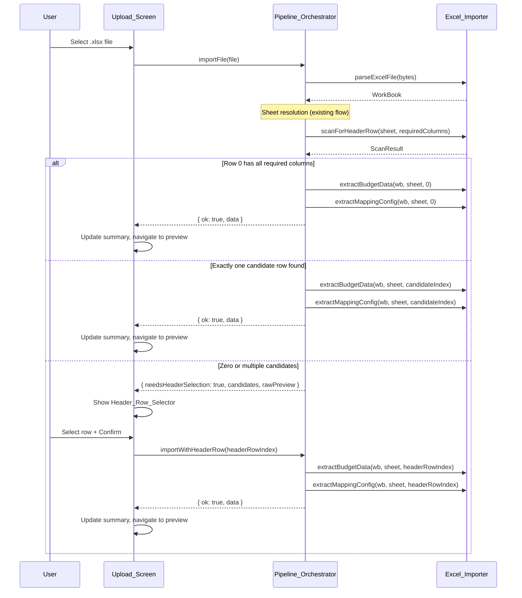

# Design Document: Header Row Selection

## Overview

The Excel_Importer currently hardcodes `raw[0]` as the header row in both `extractBudgetData` and `extractMappingConfig`. This works when the required columns (Entity, Account, DC) are in the first row, but breaks when sheets have title rows, metadata, or blank rows above the actual headers.

This design adds a header row detection and selection step to the import pipeline. After a sheet is resolved (either "Budget" auto-detected or user-selected), the importer scans the first 20 rows for rows containing all required columns. If row 0 matches, the import proceeds automatically. If exactly one other row matches, it auto-selects that row. If zero or multiple rows match, the user is prompted with a Header_Row_Selector dropdown. The Upload_Screen also gains a progressive summary showing resolved import variables (filename, sheet, header row) as each step completes.

### Key Design Decisions

1. **Scan limit of 20 rows**: Scanning the first 20 rows balances coverage with performance. Budget files rarely have more than a few preamble rows. This avoids scanning thousands of rows in large sheets.
2. **Case-insensitive matching**: Required column matching reuses the same case-insensitive logic already in `extractMappingConfig`'s `findColumn` helper, ensuring consistency.
3. **Header row index passed through extraction**: Rather than modifying the raw data array, the header row index is passed to `extractBudgetData` and `extractMappingConfig`, which slice the raw data accordingly. This keeps the sheet data intact for preview purposes.
4. **Progressive summary as simple DOM updates**: The progress summary is built with plain DOM elements consistent with the existing UI approach — no framework needed.
5. **Zero candidates = manual selection from all 20 rows**: When no row matches automatically, the user can pick any row from 1–20 (1-based display). This handles edge cases where column names are slightly different or the scan missed them.

## Architecture



## Components and Interfaces

### Modified: Excel_Importer (`frontend/src/import/excel-importer.ts`)

New exported function for header row scanning:

```typescript
/** Result of scanning a sheet for header rows. */
export interface HeaderScanResult {
  /** Zero-based indices of rows containing all required columns. */
  candidateRows: number[];
  /** First 20 rows of raw data for preview (each row is an array of cell values). */
  rawPreview: unknown[][];
}

/**
 * Scan the first 20 rows of a sheet for rows containing all required columns.
 * Uses case-insensitive matching consistent with extractMappingConfig.
 * If the sheet has fewer than 20 rows, scans all available rows.
 */
export function scanForHeaderRow(
  workbook: XLSX.WorkBook,
  sheetName: string,
): HeaderScanResult | ParseError;
```

Modified signatures for `extractBudgetData` and `extractMappingConfig`:

```typescript
/**
 * Extract budget data from the named sheet, using the specified header row.
 * @param headerRowIndex Zero-based index of the row to use as column headers.
 *   Defaults to 0 for backward compatibility.
 */
export function extractBudgetData(
  workbook: XLSX.WorkBook,
  sheetName?: string,
  headerRowIndex?: number,
): TabularData | ParseError;

/**
 * Extract column mapping configuration from the specified header row.
 * @param headerRowIndex Zero-based index of the row to use as column headers.
 *   Defaults to 0 for backward compatibility.
 */
export function extractMappingConfig(
  workbook: XLSX.WorkBook,
  sheetName?: string,
  headerRowIndex?: number,
): MappingConfig | MappingError;
```

New internal helper (exported for testing):

```typescript
/**
 * Check if a row contains all required columns using case-insensitive matching.
 * Exported for direct testing in property tests.
 */
export function rowContainsRequiredColumns(
  row: unknown[],
  requiredColumns?: readonly string[],
): boolean;
```

### Modified: Pipeline_Orchestrator (`frontend/src/pipeline/orchestrator.ts`)

New result type for header row selection:

```typescript
/** Returned when the user must select a header row. */
export interface HeaderSelectionNeeded {
  needsHeaderSelection: true;
  /** Zero-based candidate row indices (may be empty). */
  candidateRows: number[];
  /** First 20 rows of raw sheet data for preview display. */
  rawPreview: unknown[][];
}

/** Extended import result union. */
export type ImportResult =
  | Result<TabularData>
  | SheetSelectionNeeded
  | HeaderSelectionNeeded;

/** Type guard for HeaderSelectionNeeded. */
export function isHeaderSelectionNeeded(
  result: ImportResult,
): result is HeaderSelectionNeeded;
```

New/modified methods on `PipelineOrchestrator`:

| Method | Signature | Description |
|---|---|---|
| `importFile` (modified) | `(file: File) => Promise<ImportResult>` | After sheet resolution, scans for header row. Returns `HeaderSelectionNeeded` when auto-detection fails. |
| `importWithSheet` (modified) | `(sheetName: string) => Promise<ImportResult>` | After sheet extraction, scans for header row. May return `HeaderSelectionNeeded`. |
| `importWithHeaderRow` (new) | `(headerRowIndex: number) => Promise<Result<TabularData>>` | Extracts data using the specified header row from the pending workbook/sheet. |

New internal state:

```typescript
private _pendingSheetName: string | null = null;
```

### New: Header_Row_Selector Component (`frontend/src/ui/components/header-row-selector.ts`)

```typescript
export interface HeaderRowSelectorOptions {
  /** Zero-based candidate row indices. If empty, all rows 0–19 are offered. */
  candidateRows: number[];
  /** Raw sheet data rows for preview display. */
  rawPreview: unknown[][];
  onConfirm: (headerRowIndex: number) => void;
  onCancel: () => void;
}

/**
 * Render a header row selection dropdown with row previews.
 * Each option shows the 1-based row number and the first 3 cell values.
 * Returns the root element for insertion into the DOM.
 */
export function createHeaderRowSelector(
  options: HeaderRowSelectorOptions,
): HTMLElement;
```

Behavior:
- When `candidateRows` is non-empty: dropdown contains only those rows
- When `candidateRows` is empty: dropdown contains rows 0–19 (or fewer if the sheet is shorter), displayed as 1-based numbers
- Each option label: `"Row {n}: {cell1}, {cell2}, {cell3}"` (first 3 cell values, truncated)
- "Confirm" button disabled until a row is selected
- "Cancel" calls `onCancel`
- On confirm, calls `onConfirm(selectedZeroBasedIndex)`

### Modified: Upload_Screen (`frontend/src/ui/screens/upload.ts`)

Updates to the upload screen:

1. Import `isHeaderSelectionNeeded` and `createHeaderRowSelector`
2. Add a progress summary section showing filename, sheet name, header row as they resolve
3. After `importFile` or `importWithSheet`, check for `HeaderSelectionNeeded`
4. If header selection needed: render `Header_Row_Selector`, update summary
5. On confirm: call `orchestrator.importWithHeaderRow(index)`, handle result
6. On cancel: call `orchestrator.cancelPendingImport()`, clear summary, reset UI

New helper for the progress summary:

```typescript
/** Create or update the progress summary display. */
function updateProgressSummary(
  container: HTMLElement,
  items: { label: string; value: string }[],
): void;
```

## Data Models

No backend changes. All types are frontend-only TypeScript.

### New TypeScript Types

```typescript
// In frontend/src/import/excel-importer.ts
export interface HeaderScanResult {
  candidateRows: number[];
  rawPreview: unknown[][];
}

// In frontend/src/pipeline/orchestrator.ts
export interface HeaderSelectionNeeded {
  needsHeaderSelection: true;
  candidateRows: number[];
  rawPreview: unknown[][];
}
```

### State Changes in PipelineOrchestrator

| Field | Type | Purpose |
|---|---|---|
| `_pendingSheetName` | `string \| null` | Tracks which sheet is being imported when header selection is needed |

The existing `_pendingWorkbook` field is reused. Both are cleared on cancel/reset.


## Correctness Properties

*A property is a characteristic or behavior that should hold true across all valid executions of a system — essentially, a formal statement about what the system should do. Properties serve as the bridge between human-readable specifications and machine-verifiable correctness guarantees.*

### Property 1: Row 0 auto-detection

*For any* sheet whose first row contains all Required_Columns (Entity, Account, DC) in any case variation, `scanForHeaderRow` SHALL return a `candidateRows` array that includes index 0.

**Validates: Requirements 1.1**

### Property 2: Scan finds all and only matching rows

*For any* sheet with known row contents, `scanForHeaderRow` SHALL return a `candidateRows` array containing exactly the zero-based indices of rows (within the first 20) that contain all Required_Columns (case-insensitive), with no extra or missing indices. If the sheet has fewer than 20 rows, only available rows are scanned.

**Validates: Requirements 2.1, 2.2, 2.3, 2.4, 2.5**

### Property 3: Header row selector renders correct options with previews

*For any* list of candidate row indices and raw preview data, rendering a `Header_Row_Selector` SHALL produce a `<select>` element with exactly one `<option>` per candidate row (or one per available row up to 20 when candidates is empty), each displaying the 1-based row number and the first three cell values from that row.

**Validates: Requirements 3.2, 3.3**

### Property 4: Extraction with header row index

*For any* valid sheet and *for any* zero-based header row index pointing to a row that contains all Required_Columns, `extractBudgetData(wb, sheet, headerRowIndex)` SHALL return a `TabularData` whose columns are derived from the specified row and whose data rows are all rows after the header row index (rows above the header are excluded).

**Validates: Requirements 4.1, 4.2, 4.3**

### Property 5: Invalid header row returns MappingError

*For any* sheet and *for any* row index pointing to a row that does NOT contain all Required_Columns, `extractMappingConfig(wb, sheet, headerRowIndex)` SHALL return a `MappingError` whose `missingColumns` array is non-empty.

**Validates: Requirements 4.4**

### Property 6: Backward compatibility — full auto-import

*For any* workbook containing a "Budget" sheet with Required_Columns in row 0 (plus valid month columns and at least one data row), calling `importFile` SHALL return a successful `Result<TabularData>` without returning `SheetSelectionNeeded` or `HeaderSelectionNeeded`.

**Validates: Requirements 1.2, 6.1**

### Property 7: Sheet selection then auto header detection

*For any* workbook without a "Budget" sheet but containing a sheet with Required_Columns in row 0 (plus valid month columns and data), after sheet selection via `importWithSheet`, the result SHALL be a successful `Result<TabularData>` without returning `HeaderSelectionNeeded`.

**Validates: Requirements 6.2**

## Error Handling

| Scenario | Component | Behavior |
|---|---|---|
| Sheet has fewer than 20 rows | `scanForHeaderRow` | Scans only available rows; returns results normally (no error) |
| No candidate rows found | `Pipeline_Orchestrator` | Returns `HeaderSelectionNeeded` with empty `candidateRows` and `rawPreview`; UI shows all rows 1–20 |
| User-selected header row missing required columns | `extractMappingConfig` | Returns `MappingError` with `missingColumns` list |
| Header selection error displayed | `Upload_Screen` | Shows error banner, keeps Header_Row_Selector visible so user can pick another row or cancel |
| Cancel during header selection | `Pipeline_Orchestrator` | Clears `_pendingWorkbook` and `_pendingSheetName`; Upload_Screen resets to initial state |
| `importWithHeaderRow` called without pending state | `Pipeline_Orchestrator` | Returns `{ ok: false, error: "No pending import. Call importFile() first." }` |
| Sheet is empty (zero rows) | `scanForHeaderRow` | Returns `{ candidateRows: [], rawPreview: [] }` |

## Testing Strategy

### Unit Tests (Vitest)

Specific examples and edge cases:

- **Header_Row_Selector component**: Confirm button disabled on initial render (3.6); Confirm button enabled after selection; Cancel calls `onCancel` (3.5); Confirm calls `onConfirm` with correct zero-based index (3.4); Empty candidates shows rows 1–20 (3.3)
- **Upload_Screen integration**: Header_Row_Selector appears when `HeaderSelectionNeeded` returned (3.1); Error after header selection returns to selector (7.1); Cancel resets to initial state and clears summary (7.3)
- **Progress summary**: Filename shown after file selection (5.1); Sheet name shown after resolution (5.2); Header row shown after resolution (5.3); Summary cleared on cancel (5.5)
- **Edge cases**: Sheet with fewer than 20 rows scans without error (7.2); Empty sheet returns empty candidates; `importWithHeaderRow` without pending state returns error

### Property-Based Tests (fast-check + Vitest)

Each correctness property is implemented as a single property-based test with a minimum of 100 iterations. Tests use `fast-check` (already in the project).

Tag format: `Feature: header-row-selection, Property {N}: {title}`

| Property | Test Description | Generator Strategy |
|---|---|---|
| Property 1 | Generate sheets with required columns in row 0 (random case); verify candidateRows includes 0 | `fc.record` with random case variations of Entity/Account/DC in row 0 |
| Property 2 | Generate sheets with known placement of required-column rows; verify candidateRows matches exactly | Place required columns at random subset of row indices 0–19; fill other rows with non-matching data |
| Property 3 | Generate random candidate indices and raw preview arrays; render component; verify option count, labels, and 1-based numbering | `fc.array(fc.integer({min:0,max:19}))` for candidates, `fc.array(fc.array(fc.string()))` for preview |
| Property 4 | Generate sheets with required columns at a random row; call extractBudgetData with that index; verify columns and row count | Place headers at random index 0–19, data rows after |
| Property 5 | Generate sheets; pick a row without required columns; call extractMappingConfig; verify MappingError | Generate rows without Entity/Account/DC at the chosen index |
| Property 6 | Generate workbooks with Budget sheet, headers in row 0, valid month columns, data; verify importFile returns ok | Reuse workbook builder from dynamic-sheet-selection tests, ensure row 0 has required + month columns |
| Property 7 | Generate workbooks without Budget, one sheet with headers in row 0 + month columns; do importWithSheet; verify ok result | Similar to Property 6 but without "Budget" sheet name |

Each property test must reference its design property in a comment:
```typescript
// Feature: header-row-selection, Property 1: Row 0 auto-detection
```
