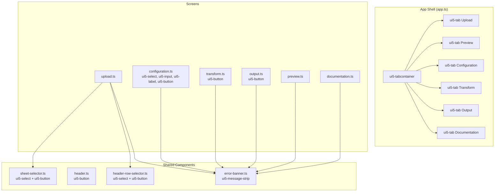

# Design Document: UI5 Web Components Migration

## Overview

This design describes the migration of the Data Conversion Tool frontend from plain HTML elements with inline CSS to UI5 Web Components v2.7+. The frontend is a plain TypeScript + Vite application (no framework). All UI is built via `document.createElement()` calls in 10 source files:

- **App shell**: `frontend/src/ui/app.ts`
- **Components**: `error-banner.ts`, `header.ts`, `sheet-selector.ts`, `header-row-selector.ts`
- **Screens**: `upload.ts`, `preview.ts`, `configuration.ts`, `transform.ts`, `output.ts`, `documentation.ts`

The migration replaces plain `<button>`, `<select>`, `<input>`, `<input type="file">`, and `<div role="alert">` elements with their `ui5-*` equivalents. Navigation moves from a hand-rolled `<nav>` with buttons to `ui5-tabcontainer` + `ui5-tab`. Inline `style.cssText` assignments on migrated elements are removed in favor of UI5 built-in theming. Layout-only styles on wrapper `<div>` elements are retained as minimal inline styles or CSS classes.

The migration is incremental — one file at a time — so the app remains functional after each commit.

## Architecture

### Migration Strategy: File-by-File, Bottom-Up

The migration proceeds bottom-up: shared components first, then screens, then the app shell. This order ensures that when a screen is migrated, the components it depends on are already using UI5.

```
Phase 1 — Shared components (no screen dependencies)
  1. error-banner.ts        → ui5-message-strip
  2. header.ts              → ui5-button for PDF action
  3. sheet-selector.ts      → ui5-select + ui5-option + ui5-button
  4. header-row-selector.ts → ui5-select + ui5-option + ui5-button

Phase 2 — Screens (depend on components)
  5. upload.ts              → uses migrated sheet-selector, header-row-selector
  6. configuration.ts       → ui5-select, ui5-input, ui5-label, ui5-button
  7. transform.ts           → ui5-button
  8. output.ts              → ui5-button
  9. preview.ts             → no interactive elements to migrate (display only)
  10. documentation.ts      → minimal changes (details/summary kept)

Phase 3 — App shell
  11. app.ts                → ui5-tabcontainer + ui5-tab, remove nav bar
```

### What Changes Per File

Each migrated file undergoes the same transformation pattern:

1. **Add side-effect imports** at the top of the file for every UI5 component used.
2. **Replace `document.createElement("tag")`** calls with `document.createElement("ui5-tag")`.
3. **Replace child `<option>` elements** with `ui5-option` elements (for selects).
4. **Replace event listeners** — UI5 `ui5-select` fires `change` as a `CustomEvent` with `detail.selectedOption`; `ui5-button` fires standard `click`.
5. **Set UI5 attributes** — `design`, `value-state`, `type`, `placeholder`, `disabled` via `setAttribute()`.
6. **Remove `style.cssText`** from migrated elements. Keep layout-only styles on wrapper divs.

### Architectural Diagram



## Components and Interfaces

### Component Mapping Table

| Source File | Plain HTML Element | UI5 Replacement | UI5 Tag | Side-Effect Import |
|---|---|---|---|---|
| `error-banner.ts` | `<div role="alert">` | MessageStrip | `ui5-message-strip` | `@ui5/webcomponents/dist/MessageStrip.js` |
| `header.ts` | `<button>` (PDF) | Button | `ui5-button` | `@ui5/webcomponents/dist/Button.js` |
| `sheet-selector.ts` | `<select>` | Select | `ui5-select` | `@ui5/webcomponents/dist/Select.js` |
| `sheet-selector.ts` | `<option>` | Option | `ui5-option` | `@ui5/webcomponents/dist/Option.js` |
| `sheet-selector.ts` | `<button>` (Confirm) | Button (Emphasized) | `ui5-button` | `@ui5/webcomponents/dist/Button.js` |
| `sheet-selector.ts` | `<button>` (Cancel) | Button (Transparent) | `ui5-button` | `@ui5/webcomponents/dist/Button.js` |
| `header-row-selector.ts` | `<select>` | Select | `ui5-select` | `@ui5/webcomponents/dist/Select.js` |
| `header-row-selector.ts` | `<option>` | Option | `ui5-option` | `@ui5/webcomponents/dist/Option.js` |
| `header-row-selector.ts` | `<button>` (Confirm/Cancel) | Button | `ui5-button` | `@ui5/webcomponents/dist/Button.js` |
| `configuration.ts` | `<select>` (Package) | Select | `ui5-select` | `@ui5/webcomponents/dist/Select.js` |
| `configuration.ts` | `<select>` (Template) | Select | `ui5-select` | (same import) |
| `configuration.ts` | `<input type="text">` | Input | `ui5-input` | `@ui5/webcomponents/dist/Input.js` |
| `configuration.ts` | `<input type="number">` | Input (Number) | `ui5-input` | (same import) |
| `configuration.ts` | `<label>` | Label | `ui5-label` | `@ui5/webcomponents/dist/Label.js` |
| `configuration.ts` | `<button>` (Apply) | Button (Emphasized) | `ui5-button` | `@ui5/webcomponents/dist/Button.js` |
| `upload.ts` | `<input type="file">` | FileUploader | `ui5-file-uploader` | `@ui5/webcomponents/dist/FileUploader.js` |
| `transform.ts` | `<button>` (Run) | Button (Emphasized) | `ui5-button` | `@ui5/webcomponents/dist/Button.js` |
| `output.ts` | `<button>` (CSV/Excel/PDF) | Button (Default) | `ui5-button` | `@ui5/webcomponents/dist/Button.js` |
| `app.ts` | `<nav>` + `<button>` tabs | TabContainer + Tab | `ui5-tabcontainer` + `ui5-tab` | `@ui5/webcomponents/dist/TabContainer.js`, `@ui5/webcomponents/dist/Tab.js` |

### Interface Changes

No public TypeScript interfaces change. The functions `showError`, `clearError`, `createSheetSelector`, `createHeaderRowSelector`, `createHeader`, and each screen's `render` function keep their existing signatures. The internal implementation changes from plain HTML to UI5 elements.

### Event Handling Differences

| Component | Old Event | New Event | Notes |
|---|---|---|---|
| Select (sheet/header-row/config) | `change` on `<select>` → `select.value` | `change` on `ui5-select` → `(e as CustomEvent).detail.selectedOption.value` | Must cast to `CustomEvent` and read `detail.selectedOption` |
| Button (all) | `click` on `<button>` | `click` on `ui5-button` | Same event name, works identically |
| FileUploader | `change` on `<input type="file">` → `input.files` | `change` on `ui5-file-uploader` → `(e as CustomEvent).detail.files` | Files come from `detail.files`, not `target.files` |
| TabContainer | `click` on `<button>` | `tab-select` on `ui5-tabcontainer` → `(e as CustomEvent).detail.tab` | New event name; `detail.tab` is the selected `ui5-tab` element |

### Import Strategy

Every file that creates a `ui5-*` element must import the corresponding module at the top level. These are side-effect-only imports that register the custom element globally:

```typescript
// error-banner.ts
import "@ui5/webcomponents/dist/MessageStrip.js";

// sheet-selector.ts
import "@ui5/webcomponents/dist/Select.js";
import "@ui5/webcomponents/dist/Option.js";
import "@ui5/webcomponents/dist/Button.js";

// app.ts
import "@ui5/webcomponents/dist/TabContainer.js";
import "@ui5/webcomponents/dist/Tab.js";
```

Duplicate imports across files are fine — the browser/bundler deduplicates them. Each file is self-contained for its UI5 dependencies.

## Data Models

No data model changes. The migration is purely a UI layer change. All domain types (`FinancialDocument`, `FinancialLine`, etc.), API response types, orchestrator state, and screen context interfaces remain unchanged.

The `ScreenContext` interface in `app.ts` stays the same:

```typescript
export interface ScreenContext {
  orchestrator: PipelineOrchestrator;
  navigate: (screen: ScreenName) => void;
  contentEl: HTMLElement;
  errorEl: HTMLElement;
  getPdfOptions: () => PDFExportOptions | null;
}
```

The `SheetSelectorOptions`, `HeaderRowSelectorOptions`, and `HeaderOptions` interfaces are unchanged. Only the internal DOM construction code changes.

## Correctness Properties

*A property is a characteristic or behavior that should hold true across all valid executions of a system — essentially, a formal statement about what the system should do. Properties serve as the bridge between human-readable specifications and machine-verifiable correctness guarantees.*

### Property 1: Side-effect import discipline

*For any* source file in `frontend/src/ui/` that calls `document.createElement("ui5-X")` for some component X, the file shall contain a top-level side-effect import for the corresponding `@ui5/webcomponents/dist/{ComponentModule}.js` module. This must hold for every distinct `ui5-*` tag used in the file.

**Validates: Requirements 1.4, 2.3, 3.4, 4.3, 5.7, 6.7, 7.9, 8.5, 9.3, 12.1, 12.2**

### Property 2: No inline styles on UI5 elements

*For any* UI5 custom element (`ui5-*`) created by the migrated code, the element shall not have an inline `style` attribute set via `style.cssText` or `setAttribute("style", ...)`. Only non-UI5 wrapper/layout elements may have inline styles.

**Validates: Requirements 1.5, 11.1**

### Property 3: showError renders a correct message strip

*For any* non-empty error message string and any empty container element, calling `showError(container, message)` shall produce a child `ui5-message-strip` element with `design="Negative"`, `role="alert"`, and text content equal to the provided message.

**Validates: Requirements 3.1, 3.3**

### Property 4: showError/clearError round trip

*For any* non-empty error message string and any container element, calling `showError(container, message)` followed by `clearError(container)` shall result in the container having no child elements.

**Validates: Requirements 3.2**

### Property 5: Selector components render correct UI5 structure

*For any* non-empty list of option values (sheet names or candidate row indices), the corresponding selector component (`createSheetSelector` or `createHeaderRowSelector`) shall render a `ui5-select` containing exactly one `ui5-option` per option value, a `ui5-button` with `design="Emphasized"` (Confirm), and a `ui5-button` with `design="Transparent"` (Cancel).

**Validates: Requirements 5.1, 5.2, 5.3, 6.1, 6.2, 6.3**

### Property 6: Selector enable-on-select

*For any* selector component (sheet or header-row) with at least one option, the Confirm button shall be disabled initially, and after programmatically selecting an option in the `ui5-select`, the Confirm button shall become enabled.

**Validates: Requirements 5.4, 6.4**

### Property 7: Selector confirm callback delivers selected value

*For any* selector component and any valid option value, selecting that option and clicking the Confirm button shall invoke the `onConfirm` callback with exactly the selected value (sheet name string or row index number).

**Validates: Requirements 5.5, 6.5**

### Property 8: Configuration select options match data

*For any* list of package names or template names, the corresponding `ui5-select` in the Configuration screen shall contain one `ui5-option` per item, with each option's value and text matching the item.

**Validates: Requirements 7.1, 7.2**

### Property 9: Configuration validation sets Negative value-state

*For any* combination of missing required fields (empty package, empty template, empty budgetcode, invalid year), clicking the Apply button shall set `value-state="Negative"` on each corresponding UI5 input/select element that is invalid.

**Validates: Requirements 7.6, 7.7, 7.8**

### Property 10: Label-for-input accessibility pairing

*For any* `ui5-label` element in the Configuration screen, its `for` attribute shall reference the `id` of a corresponding `ui5-input` or `ui5-select` element that exists in the same form.

**Validates: Requirements 7.10**

## Error Handling

Error handling behavior is unchanged by the migration. The only change is the rendering mechanism:

- **Before**: `showError` creates a `<div role="alert">` with inline red styling.
- **After**: `showError` creates a `<ui5-message-strip design="Negative">` with `role="alert"`.

The `clearError` function continues to clear the container's `innerHTML`.

All screen-level error handling (try/catch around async operations, `result.ok` checks, error message display) remains identical. The orchestrator's error propagation is not affected.

UI5 `value-state="Negative"` is added to the Configuration screen for inline validation feedback on individual form fields. This is additive — the existing `showError` banner is still used for API errors and general validation messages.

## Testing Strategy

### Testing Environment

- **Test runner**: Vitest (already configured in `frontend/package.json`)
- **DOM environment**: jsdom (already a dev dependency)
- **Property-based testing**: fast-check v3.23+ (already a dev dependency)

Since UI5 Web Components are custom elements that require browser registration, tests will need to either:
1. Mock the custom element registration (for unit tests that check DOM structure)
2. Use a minimal custom element polyfill/stub that allows `document.createElement("ui5-*")` to return elements with the expected attributes

The recommended approach is to create a small test helper that registers stub custom elements for the UI5 tags used in tests. This avoids importing the full UI5 runtime in jsdom.

### Unit Tests (Specific Examples and Edge Cases)

Unit tests verify concrete scenarios:

- **App shell**: Renders 6 tabs with correct labels; tab selection navigates to correct screen.
- **Header**: PDF button is a `ui5-button` with `design="Default"`; clicking it calls the PDF handler.
- **Upload screen**: Contains a `ui5-file-uploader` with `accept=".xlsx"`.
- **Transform screen**: Run button is `ui5-button` with `design="Emphasized"`; disabled during transform.
- **Output screen**: Three export buttons are `ui5-button` with `design="Default"`.
- **Documentation screen**: Still uses `<details>`/`<summary>` for collapsible sections.
- **Edge case**: `showError` with empty string; `clearError` on already-empty container.
- **Edge case**: Selector with single option; selector with many options (20+).

### Property-Based Tests (Universal Properties via fast-check)

Each correctness property from the design is implemented as a single property-based test with minimum 100 iterations. Tests are tagged with the property reference.

```typescript
// Example tag format:
// Feature: ui5-migration, Property 3: showError renders a correct message strip
```

Property tests focus on:
- **Property 1**: Static analysis of source files (import discipline) — can be tested by parsing file contents with regex.
- **Property 2**: No inline styles on UI5 elements — generate random component configurations, render, check no `style` attribute on `ui5-*` elements.
- **Property 3**: showError with random strings — verify message strip attributes.
- **Property 4**: showError/clearError round trip with random strings — verify container is empty after clear.
- **Property 5**: Selector rendering with random option lists — verify DOM structure.
- **Property 6**: Selector enable-on-select with random option lists — verify button state.
- **Property 7**: Selector confirm callback with random selections — verify callback argument.
- **Property 8**: Configuration select with random package/template lists — verify option elements.
- **Property 9**: Configuration validation with random invalid states — verify value-state attributes.
- **Property 10**: Label-for-input pairing — verify all labels reference existing inputs.

### Test Configuration

- Each property test runs minimum 100 iterations (`fc.assert(property, { numRuns: 100 })`)
- Each property test includes a comment tag: `Feature: ui5-migration, Property {N}: {title}`
- Property tests use fast-check arbitraries to generate random inputs (strings, arrays of strings, numbers)
- Unit tests cover specific examples, integration flows, and edge cases
- Both test types run via `vitest --run`
